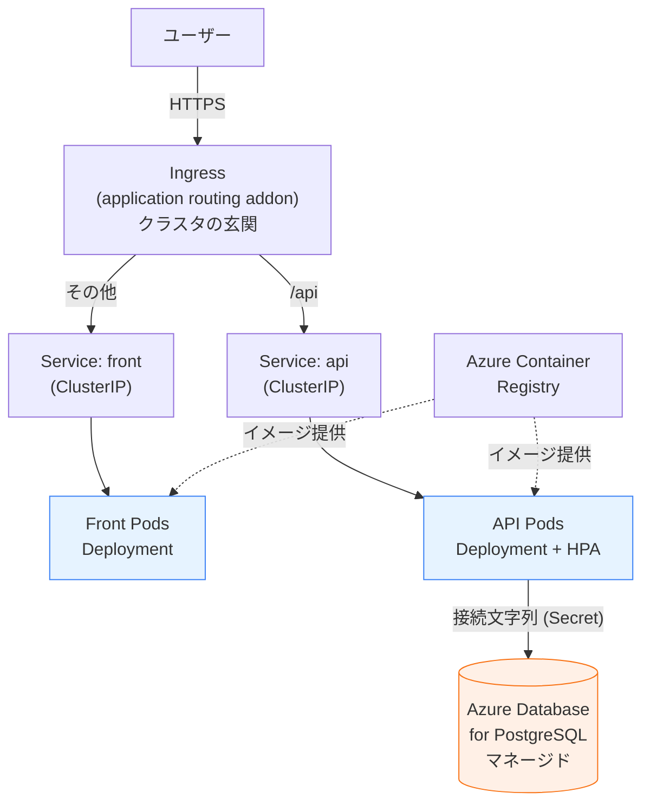

## この記事について

前回の記事「Docker は何となく使える人のための Kubernetes 入門」（※公開後に URL を差し込んでください）では、Kubernetes（以下 K8s）を **概念の地図** として読み解きました。宣言的モデル（「望ましい状態」を書けば差分を埋め続けてくれる）、Node / Pod / Deployment / Service の最小限の用語、マニフェスト YAML の読み方——ここまでが前回のゴールでした。

そして前回は、最後にこう締めくくっています。

> **ステートレスな部分は K8s に、DB はマネージドサービス（RDS / Cloud SQL など）に逃がす**

本記事は、**この一文を Azure 上で実際に手を動かして組む**ものです。`az` と `kubectl` を叩いて、概念として理解した K8s リソースを、外部のマネージド DB に繋がる現実的な Web アプリへ落とし込みます。狙いは「動かして終わり」ではありません。**作り終えたとき、K8s が何を担い、何を Azure に任せたのかを、構成の線引きとして説明できるようになる**——そこをゴールに置きます。

### この記事の前提

- Azure サブスクリプションがある（無料アカウントでも可）
- [Azure CLI（`az`）](https://learn.microsoft.com/azure/cli/azure/install-azure-cli) がインストール済みで `az login` できる
- `kubectl` は後で `az` 経由で入れます（手元になくても進められます）
- **K8s の概念は前回記事レベルで理解している**（Deployment / Service / Ingress / HPA / ConfigMap / Secret が何かは説明できる）
- Azure と技術全般は分かるが、K8s を**クラウドで実際に動かしたことはない**

### この記事の設計方針 —「K8s を主役にする」ための引き算

実践記事でありがちな失敗は、周辺のクラウドサービスを盛りすぎて、肝心の K8s の学びが薄まることです。本記事は逆を行きます。

- **主役は K8s**。Deployment / Service / Ingress / HPA / ConfigMap / Secret を、前回の用語マップそのままに実際のマニフェストへ落とす。
- 周辺の Azure サービスは **2 つだけ**に絞る。
  - **Azure Container Registry（ACR）**: イメージの置き場所。これは省けない（後述）。
  - **Azure Database for PostgreSQL フレキシブルサーバー**: マネージド DB。前回の「DB は逃がす」を実装する相手。
- 一方で、現実のアプリで使われがちな **APIM / Redis などのキャッシュ / Front Door / Key Vault の作り込み / 監視・ログ・CI-CD / VNet 分離（Private Endpoint）/ DB の HA・バックアップ詳細設計**は、**意図的に省きます**。

最後の引き算は妥協ではありません。POC（検証用の最小構成）として自然な省略であり、むしろ「K8s の役割を浮かび上がらせる」ための設計判断です。何を省いたかは最後にまとめて、それぞれ「現実では次に何を足すか」として触れます。

## 作るもの — 構成の全体像

題材は、前回の最終章で俯瞰した構成を**2 層に絞った最小版**です。「フロント＋ API＋ DB」という、どこにでもある形にします。

- **フロントエンド**: ブラウザに画面を返す。ステートレス。
- **API サーバ**: フロントからのリクエストを処理し、DB を読み書きする。ステートレス。
- **データベース**: データを永続化する。**ステートフル**。

前回、ステートレス（青）とステートフル（橙）を塗り分けた図を、そのまま Azure の実物に置き換えます。



青いフロントと API は **AKS の中**に、Deployment + Service として置きます。橙の DB は **AKS の外**、Azure のマネージドサービスに逃がします。前回「色の違いが後で効いてくる」と書いた、その後がここです。

部品と、それを実現する Azure / K8s リソースの対応を先に並べておきます。

| 役割 | 何で実現するか | 持ち主 |
|---|---|---|
| イメージの置き場所 | Azure Container Registry (ACR) | Azure マネージド |
| クラスタ（頭脳と計算機） | AKS（control plane + Node） | control plane は Azure、Node は自分 |
| ステートレスアプリの稼働・維持 | **Deployment** | K8s |
| 内部の安定した入口 | **Service (ClusterIP)** | K8s |
| 外部公開・HTTP ルーティング | **Ingress** + Azure Load Balancer | K8s（LB は Azure が払い出す） |
| 負荷に応じた自動スケール | **HorizontalPodAutoscaler** | K8s |
| 設定・接続情報の分離 | **ConfigMap / Secret** | K8s |
| データの永続化 | Azure Database for PostgreSQL | Azure マネージド |

太字が K8s の担当、つまり**本記事の主役**です。残りは Azure に任せます。この表が、最後のまとめでそのまま「線引き」として効いてきます。

## 全体の流れ

手順は大きく次の順で進みます。各ステップが「何のためか」を一言添えておきます。

1. **リソースグループ + ACR を作り、イメージをビルド&プッシュ** — K8s が動かす"中身"の置き場所を用意する
2. **AKS クラスタを作り、ACR と繋ぐ** — 望ましい状態を維持する基盤を立てる
3. **マネージド PostgreSQL を作る** — ステートフルを K8s の外へ逃がす
4. **マニフェストを書いて `kubectl apply`** — 前回の用語を動く YAML にする（主役パート）
5. **外部に公開する（Service / Ingress）** — 玄関を作る
6. **スケールと自己修復を体感する（HPA）** — 「魔法ではなくループ」を目で見る

では順に進めます。以降のコマンドは、共通の変数を最初に決めておくと読みやすくなります（リージョンや名前は適宜変えてください。ACR 名は **Azure 全体で一意・小文字英数字のみ**である必要があります）。

```bash
# 共通変数（お好みで変更）
RG=rg-aks-demo
LOCATION=japaneast
ACR=acraksdemo$RANDOM      # 全体で一意・小文字英数字のみ
AKS=aks-demo
PG=pg-aks-demo-$RANDOM     # 全体で一意
```

## ステップ1: イメージの置き場所 — ACR を作ってビルド&プッシュ

最初の疑問は「なぜわざわざレジストリが要るのか」です。前回、こう書きました——「`docker build` で作ったイメージは、これまで通り K8s クラスタでそのまま動く」。ただし**そのイメージを、AKS のノードが取りに行ける場所に置いておく必要があります**。

AKS の各 Node 上では、コンテナを動かすのは Docker ではなく [containerd というランタイム](https://learn.microsoft.com/azure/aks/cluster-configuration)です（前回触れた「Docker の実体はスタックで、その一部が containerd」の、まさに containerd 側）。この containerd は、あなたの手元の `docker build` で作ったローカルイメージを知りません。だから、**クラウド上の共有の置き場所**にイメージを置き、そこから pull させます。それが ACR です。

まずリソースグループと ACR を作ります。

```bash
az group create --name $RG --location $LOCATION

az acr create \
  --resource-group $RG \
  --name $ACR \
  --sku Basic
```

次にイメージをビルドしてプッシュします。ここで便利なのが [`az acr build`](https://learn.microsoft.com/azure/aks/tutorial-kubernetes-prepare-acr) です。これは **ACR Tasks の機能で、ビルド自体をクラウド側（ACR）で実行**します。つまり**手元に Docker がなくても**、Dockerfile さえあればイメージのビルドとプッシュが完結します。

```bash
# api/ と front/ にそれぞれ Dockerfile がある前提
az acr build --registry $ACR --image myapp/api:v1 ./api
az acr build --registry $ACR --image myapp/front:v1 ./front
```

プッシュされたイメージは、`<ACR名>.azurecr.io/myapp/api:v1` のような名前で参照できます。この名前を、後でマニフェストの `image:` に書きます。前回「`docker run` で指定していたイメージ」に対応する、と説明したフィールドが、ここで具体的なレジストリ付きの名前になるわけです。

:::message
`az acr build` はクラウド側でビルドするため、手元の環境を汚さず、CPU アーキテクチャの差異（Apple Silicon など）にも悩まされにくいのが利点です。もちろん `docker build` でローカルビルドして `az acr login` 後に `docker push` する従来の流れでも構いません。
:::

## ステップ2: AKS クラスタを作る — そして ACR と繋ぐ

いよいよ K8s クラスタ本体です。`az aks create` 一発で作れますが、ここで効くオプションが **`--attach-acr`** です。

```bash
az aks create \
  --resource-group $RG \
  --name $AKS \
  --node-count 2 \
  --attach-acr $ACR \
  --enable-app-routing \
  --generate-ssh-keys
```

`--attach-acr` は何をしているのか。公式の説明が端的です。

> This command allows you to authorize an existing ACR in your subscription and configures the appropriate AcrPull role for the managed identity.
> （[Integrate Azure Container Registry with AKS](https://learn.microsoft.com/azure/aks/cluster-container-registry-integration) より）

意訳すると——「サブスクリプション内の既存 ACR を認可し、**マネージド ID に対して適切な AcrPull ロールを構成する**」。

ここがマネージド K8s ならではの楽な点です。前回「Pod がイメージを pull する」と概念で説明しましたが、本来はその pull に**認証**が要ります。AKS では各 Node の kubelet にマネージド ID（Azure が管理する身元）が紐づいており、`--attach-acr` がその ID に「この ACR から pull してよい」という権限（AcrPull ロール）を自動で与えます。**結果として、マニフェストにレジストリの認証情報（imagePullSecret）を一切書かずに済みます**。「Docker でビルドし K8s で動かす」の"動かす"側の配管が、これで通ります。

`--enable-app-routing` は後のステップ5で使う Ingress（マネージド NGINX）を有効にするフラグです。先に付けておきます。

クラスタができたら、`kubectl` を入れて接続情報を取り込みます。

```bash
az aks install-cli                                  # kubectl が無ければ
az aks get-credentials --resource-group $RG --name $AKS
kubectl get nodes                                   # Node が Ready で並べば成功
```

:::message alert
**バージョンとノードイメージの注意。** AKS はサポート対象の K8s バージョン・ノードイメージが時期によって動きます。たとえば Azure Linux 2.0 は 2025 年 11 月末でセキュリティ更新が終了し、2026 年 3 月末にノードイメージが削除される告知が出ています（[Quickstart の Important 注記](https://learn.microsoft.com/azure/aks/learn/quick-kubernetes-deploy-portal)）。新規作成では既定のサポート対象が選ばれますが、長く使うクラスタでは[サポートされる K8s バージョン](https://learn.microsoft.com/azure/aks/supported-kubernetes-versions)を定期的に確認してください。
:::

ここで前回の用語が一段、現実に接続します。前回「望ましい状態を受け取り差分を埋め続ける頭脳（control plane）と、各 Node でそれを実行する手足（kubelet）が分かれて存在する」と説明しました。**AKS では、その頭脳（control plane）の運用を Azure が肩代わりします**。あなたが面倒を見るのは Node 上のワークロード——つまり、これから書くマニフェストだけです。「マネージド K8s」の意味は、煎じ詰めれば「望ましい状態を維持する頭脳を Azure に預けること」だと捉えてください。

## ステップ3: マネージド DB を用意する — ステートフルを K8s の外へ

前回、DB を K8s に載せる難しさをこう書きました——状態（データ）を持つため「使い捨て・どこで動かしても同じ」という Pod の前提と真っ向からぶつかり、「バックアップ・フェイルオーバー・レプリケーションまで含めて DB を K8s 上で正しく運用する難しさは本記事の範囲を超える」と。

その難所を、ここでは**専用のマネージドサービスに丸ごと逃がします**。[Azure Database for PostgreSQL フレキシブルサーバー](https://learn.microsoft.com/azure/postgresql/configure-maintain/quickstart-create-server)を 1 コマンドで作ります。

```bash
PGADMIN=pgadmin
PGPASS='ChangeMe_Strong#Pass1'   # 実際は安全な方法で管理する

az postgres flexible-server create \
  --resource-group $RG \
  --name $PG \
  --location $LOCATION \
  --admin-user $PGADMIN \
  --admin-password "$PGPASS" \
  --tier Burstable \
  --sku-name Standard_B1ms \
  --version 16 \
  --storage-size 32 \
  --public-access 0.0.0.0
```

POC なので最小スペック（`Burstable` / `Standard_B1ms`）にしています。本番では `--tier GeneralPurpose` や `--high-availability ZoneRedundant` を検討する箇所ですが、それは今回の主役ではないので踏み込みません。

ネットワークだけ補足します。`--public-access 0.0.0.0` は、公式の定義では「**Azure 内の任意の Azure サービスからのアクセスを許可する**」設定です。

> From the Azure CLI, a firewall rule setting with a starting and ending address equal to 0.0.0.0 does the equivalent of the Allow public access from any Azure service within Azure to this server option in the portal.
> （[Firewall rules in Azure Database for PostgreSQL](https://learn.microsoft.com/azure/postgresql/security/security-firewall-rules) より）

意訳すると——「開始・終了アドレスを共に 0.0.0.0 にしたファイアウォール規則は、ポータルの『Azure 内の任意の Azure サービスからのパブリックアクセスを許可』と同等」。AKS も同じ Azure 内のサービスなので、これで AKS 上の Pod から接続できます。

:::message alert
**これは POC 向けの割り切りです。** 本番では `--public-access` ではなく、AKS と同じ VNet に DB を閉じ込める**プライベートアクセス（VNet 統合 / Private Endpoint）**にするのが定石です。今回は「K8s の役割を見せる」ことに集中するため、ネットワーク分離の作り込みは省いています。手元の `psql` から直接繋いで動作確認したい場合は、自分の IP を許可するファイアウォール規則を別途追加します（`az postgres flexible-server firewall-rule create`）。
:::

接続には TLS が要ります。接続文字列には `sslmode=require` を含めます。後で K8s の Secret に入れる接続情報は、概念的にはこの形です。

```
host=<PG名>.postgres.database.azure.com port=5432 dbname=postgres user=pgadmin password=*** sslmode=require
```

これで「橙の箱」が AKS の外に立ちました。K8s 側はもう、DB のバックアップも冗長化もパッチ当ても気にしません。**そこが逃がすことの果実です。**

## ステップ4: マニフェストを書く — 概念を YAML に落とす

ここからが本記事の主役です。前回読んだ用語マップを、**実際に動くマニフェスト**へ落とします。登場するのは ConfigMap / Secret / Deployment / Service だけ。前回「読めば意味が推測できる」ところまで行った語彙が、そのまま「書くと動く」に変わります。

### 接続情報を切り離す — Secret

DB の接続情報は、コードにもイメージにも焼き込まず、**Secret** に持たせます。前回「Secret はパスワードや API キーなど機密用の入れ物」と説明した、その実物です。

```bash
kubectl create secret generic db-conn \
  --from-literal=PGHOST=$PG.postgres.database.azure.com \
  --from-literal=PGUSER=$PGADMIN \
  --from-literal=PGPASSWORD="$PGPASS" \
  --from-literal=PGDATABASE=postgres \
  --from-literal=PGSSLMODE=require
```

機密でない設定値（ログレベルなど）は ConfigMap に分けますが、最小構成なので今回は Secret だけにしておきます。

### ステートレスアプリ本体 — Deployment

API の Deployment です。前回の Deployment マニフェストに、実運用で必須の **probe** と **resources**、そして Secret の注入（`envFrom`）を足した形になります。`image:` が、ステップ1でプッシュした ACR のイメージ名になっている点に注目してください。

```yaml
# api-deployment.yaml
apiVersion: apps/v1
kind: Deployment
metadata:
  name: api
spec:
  replicas: 2                       # 望ましい状態の「N」
  selector:
    matchLabels:
      app: api
  template:
    metadata:
      labels:
        app: api                    # Service / HPA が指差すラベル
    spec:
      containers:
        - name: api
          image: <ACR名>.azurecr.io/myapp/api:v1   # ステップ1でプッシュした名前
          ports:
            - containerPort: 8080
          envFrom:
            - secretRef:
                name: db-conn       # Secret を丸ごと環境変数に注入
          readinessProbe:           # リクエストを受けられる状態か
            httpGet:
              path: /healthz
              port: 8080
          livenessProbe:            # 生きているか（ダメなら再起動）
            httpGet:
              path: /healthz
              port: 8080
          resources:
            requests:               # スケジューラが配置に使う確保量
              cpu: "100m"
              memory: "128Mi"
            limits:                 # 使いすぎへの歯止め
              cpu: "500m"
              memory: "256Mi"
```

`<ACR名>` は実際の値（`$ACR` の中身）に置き換えてください。`envFrom.secretRef` によって、Secret の各キーがそのまま環境変数（`PGHOST` など）としてコンテナに渡ります。前回「`docker run -e` の発展形で `envFrom` から参照される」と説明したものの実物です。

フロントの Deployment も**まったく同じ骨格**です。`image` と `name` とポートが違うだけ。前回「ステートレスな三層がそろって同じ Deployment + Service のパターンで書ける／知識がそのまま使い回せる」と書いた、その使い回しを実際に体験する場面です。

```yaml
# front-deployment.yaml（API とほぼ同型。差分のみ抜粋）
apiVersion: apps/v1
kind: Deployment
metadata:
  name: front
spec:
  replicas: 2
  selector:
    matchLabels:
      app: front
  template:
    metadata:
      labels:
        app: front
    spec:
      containers:
        - name: front
          image: <ACR名>.azurecr.io/myapp/front:v1
          ports:
            - containerPort: 80
          resources:
            requests: { cpu: "50m", memory: "64Mi" }
            limits: { cpu: "200m", memory: "128Mi" }
```

### 安定した内部の入口 — Service

Pod は使い捨てで IP も変わるので、前回どおり **Service** で安定した入口を与えます。外部公開はステップ5で Ingress に任せるので、ここでは内部向けの `ClusterIP` にします。

```yaml
# services.yaml
apiVersion: v1
kind: Service
metadata:
  name: api
spec:
  selector:
    app: api                 # この Deployment が貼ったラベルに流す
  ports:
    - port: 80
      targetPort: 8080       # コンテナの containerPort
  type: ClusterIP
---
apiVersion: v1
kind: Service
metadata:
  name: front
spec:
  selector:
    app: front
  ports:
    - port: 80
      targetPort: 80
  type: ClusterIP
```

ここでも、前回「最大の鍵」と言った**ラベルによる結びつき**がそのまま効いています。Deployment が `template` で Pod に `app: api` を貼り、Service が `selector: app: api` でそれを指す。IP でも名前でもなく、ラベルが接着剤です。

まとめて適用します。

```bash
kubectl apply -f api-deployment.yaml
kubectl apply -f front-deployment.yaml
kubectl apply -f services.yaml
kubectl get pods         # Running になり、READY 1/1 で揃えば成功
```

もしここで Pod が `ImagePullBackOff` になるなら、ステップ2 の `--attach-acr` が効いていない可能性が高いです（`az aks update --attach-acr $ACR` で後付けもできます）。逆に言えば、それさえ通っていれば**認証情報を一切書かずに ACR から pull できている**——`--attach-acr` の配管が効いている証拠です。

## ステップ5: 外部に公開する — Service(LoadBalancer) と Ingress

Pod は立った。でも今のままでは外から届きません。前回の Service の `type` の話——`ClusterIP` / `NodePort` / `LoadBalancer`——が、ここで実物になります。

### まず素朴に: type LoadBalancer

一番手っ取り早い外部公開は、Service の `type` を `LoadBalancer` にすることです。前回「クラウドのロードバランサ経由で外部公開。本番の外向きで多用」と説明したタイプです。AKS でこれを宣言すると、**Azure が実際に Standard Load Balancer を払い出し、グローバル IP を割り当てます**。

試しにフロントを LoadBalancer で出すなら、`type: LoadBalancer` にして適用し、IP の払い出しを待ちます。

```bash
kubectl get service front --watch
```

最初は `EXTERNAL-IP` が `<pending>` ですが、数分で実 IP に変わります。これが [公式チュートリアル](https://learn.microsoft.com/azure/aks/tutorial-kubernetes-deploy-application)でも見られる挙動です。

```
NAME    TYPE           CLUSTER-IP    EXTERNAL-IP   PORT(S)        AGE
front   LoadBalancer   10.0.34.242   <pending>     80:30676/TCP   5s
   ↓ 数分後
front   LoadBalancer   10.0.34.242   52.179.23.131 80:30676/TCP   67s
```

`<pending>` から IP に変わる瞬間が、「K8s が望ましい状態（=外部公開された Service）に向けて Azure のリソースを動かした」結果です。マニフェストには IP もロードバランサの設定も書いていないのに、Azure 側に LB が生えている——宣言的モデルがクラウドのリソースまで貫いている、と捉えてください。

### 玄関を 1 か所に: Ingress

ただ、サービスごとに LoadBalancer を立てると、IP がアプリの数だけ増えます。前回「Service が個々のアプリの入口なら、Ingress はクラスタ全体の玄関」と説明したとおり、**複数サービスを 1 つの入口に束ね、HTTP のパスでルーティング**したいなら Ingress の出番です。

ステップ2 で `--enable-app-routing` を付けたので、AKS の **application routing addon（マネージド NGINX）** が既に有効です。これは公式が「AKS で Ingress コントローラを構成する推奨方法」とする、運用込みでマネージドな NGINX です。このアドオンは `webapprouting.kubernetes.azure.com` という Ingress クラスをクラスタに用意しており、それを指定した Ingress を作るだけで動きます。

```yaml
# ingress.yaml
apiVersion: networking.k8s.io/v1
kind: Ingress
metadata:
  name: app
spec:
  ingressClassName: webapprouting.kubernetes.azure.com
  rules:
    - http:
        paths:
          - path: /api
            pathType: Prefix
            backend:
              service:
                name: api          # /api は API の Service へ
                port:
                  number: 80
          - path: /
            pathType: Prefix
            backend:
              service:
                name: front        # それ以外はフロントの Service へ
                port:
                  number: 80
```

```bash
kubectl apply -f ingress.yaml
kubectl get ingress app          # ADDRESS 列に公開 IP が出る
```

これで「`/api` は API、それ以外はフロント」というルーティングが、1 つの玄関の裏で実現します。Service（ClusterIP）は内部に閉じたまま、外向きの口は Ingress に集約される——前回の図そのままの構造です。

:::message alert
**Ingress は今、移行期にあります（重要）。** AKS の Ingress 周辺は仕様が動いています。公式は次を明言しています。

- Kubernetes コミュニティの OSS「Ingress NGINX」プロジェクトは **2026 年 3 月でメンテナンス終了**予定。
- application routing addon（NGINX）は **2026 年 11 月まで本番ワークロードがサポート**され、その後は **Gateway API ベースの実装へ移行**することが推奨されている。

（[Ingress in Azure Kubernetes Service](https://learn.microsoft.com/azure/aks/concepts-network-ingress) / [application routing add-on](https://learn.microsoft.com/azure/aks/app-routing) より）

つまり、**学習・POC として application routing addon を使うのは今でも妥当**ですが、新規に長期運用するシステムを設計するなら、Ingress API ではなく **Gateway API**（および Application Gateway for Containers などの選択肢）への移行計画を前提にするのが安全です。本記事執筆時点（2026 年）の状況なので、構築前に上記公式ページで最新のサポート期限を必ず確認してください。
:::

## ステップ6: スケールと自己修復を体感する

最後に、前回「K8s の価値が最も分かりやすく出る」と書いた 2 つ——**自動スケール**と**自己修復**——を、実際に目で見ます。ここまで来れば、前回の HPA マニフェストはそのまま使えます。

```yaml
# hpa.yaml
apiVersion: autoscaling/v2
kind: HorizontalPodAutoscaler
metadata:
  name: api
spec:
  scaleTargetRef:
    apiVersion: apps/v1
    kind: Deployment
    name: api               # ステップ4 の API Deployment を対象に
  minReplicas: 2
  maxReplicas: 10
  metrics:
    - type: Resource
      resource:
        name: cpu
        target:
          type: Utilization
          averageUtilization: 50
```

HPA が CPU 使用率を見て個数を増減するには、メトリクスを供給する metrics-server が要りますが、**AKS では既定で有効**なので追加設定は不要です。適用して状態を見てみます。

```bash
kubectl apply -f hpa.yaml
kubectl get hpa api          # TARGETS に現在の CPU 使用率、REPLICAS に現在数
```

負荷をかければ `REPLICAS` が `minReplicas` から増えていき、収まれば戻ります（[HorizontalPodAutoscaler](https://kubernetes.io/docs/tasks/run-application/horizontal-pod-autoscale/)）。前回「セールが始まれば勝手に増え、終われば勝手に減る」と書いた挙動の実物です。

そして**自己修復**は、Pod を手で壊してみるのが一番分かります。

```bash
kubectl get pods -l app=api          # 例: api-xxxx, api-yyyy の 2 つ
kubectl delete pod api-xxxx          # 1 つ消す
kubectl get pods -l app=api          # すぐ新しい Pod が生まれ、また 2 つに戻る
```

`docker run` を打ち直した人は誰もいません。「`replicas: 2` という望ましい状態と現状（1 個になった）の差分を、制御ループが埋めた」だけです。前回「魔法ではなく、宣言された状態へ収束し続けるループ（reconciliation）が回っているだけ」と書いたものが、目の前で起きます。**この瞬間を一度見ると、ここまでの概念が一気に像を結ぶはずです。**

## ［発展］パスワードレス接続 — Workload Identity

ここまで、DB 接続情報は Kubernetes Secret に入れてきました。学習用には十分ですが、**本番ではパスワードが K8s 内に居座り続け、ローテーションも自前**という弱点があります。Azure 推奨の解は、パスワードそのものをなくす **Microsoft Entra Workload ID**（ワークロード ID）です。

仕組みだけ概観します。

> A Kubernetes token is issued and OpenID Connect (OIDC) federation enables Kubernetes applications to access Azure resources securely with Microsoft Entra ID, based on annotated service accounts.
> （[Use Microsoft Entra Workload ID on AKS](https://learn.microsoft.com/azure/aks/workload-identity-overview) より）

意訳すると——「Kubernetes のトークンが発行され、OIDC フェデレーションにより、注釈を付けた ServiceAccount を介して、Kubernetes アプリが Microsoft Entra ID で Azure リソースへ安全にアクセスできる」。

平たく言えば、**Pod に紐づいた Kubernetes の身分証（ServiceAccount トークン）を、Azure の身分証（Entra トークン）に交換し、それでマネージド ID として DB に繋ぐ**。接続文字列にパスワードを書く代わりに、取得したトークンをパスワード位置に使います（[PostgreSQL のマネージド ID 接続](https://learn.microsoft.com/azure/postgresql/security/security-connect-with-managed-identity)）。

有効化と構成の流れは次のようになります（詳細は深入りせず、地図だけ）。

```bash
# 既存クラスタで OIDC issuer と Workload ID を有効化
az aks update \
  --resource-group $RG \
  --name $AKS \
  --enable-oidc-issuer \
  --enable-workload-identity
```

この後、ユーザー割り当てマネージド ID を作り（`az identity create`）、Kubernetes の ServiceAccount にそのクライアント ID を注釈（annotation）し、両者を**フェデレーテッド資格情報**で結びます。DB 側にはそのマネージド ID をユーザーとして登録します。これで Pod は、パスワードなしで PostgreSQL に接続できます。

:::message
OIDC issuer は K8s 1.34 以上の**新規**クラスタでは既定で有効ですが、既存クラスタでは手動で有効化が必要です（有効化時に API サーバが一度再起動します。一度有効にすると無効化できません）。詳細は [Create an OIDC issuer on AKS](https://learn.microsoft.com/azure/aks/use-oidc-issuer) を参照してください。
:::

本記事の POC では Secret 方式のままで十分ですが、**「次の一歩」はこの方向**だと覚えておいてください。なお、これらの手順を自動化する [Service Connector](https://learn.microsoft.com/azure/service-connector/) という補助もあります。

## 後片付け

検証が済んだら、リソースグループごと消すのが確実です。前回紹介した公式の失敗談——「ハッカソン後にロードバランサを消し忘れて 3 週間課金され続けた」——を地で行かないよう、最後まで忘れずに。

```bash
az group delete --name $RG --yes --no-wait
```

LoadBalancer や Ingress が払い出した Azure 側の IP・LB も、リソースグループ削除でまとめて消えます（クラスタだけ消して周辺リソースが残る事故を避けられます）。

## まとめ — K8s が担ったもの、Azure に任せたもの

作り終えた構成を、冒頭の問い「**K8s は何を担い、何を Azure に任せたのか**」で振り返ります。

| K8s が担った（本記事の主役） | Azure マネージドに任せた |
|---|---|
| Deployment: 個数維持・自己修復・ローリング更新 | control plane の運用（AKS） |
| Service: 入れ替わる Pod 群への安定した入口 | イメージの保管・配布（ACR） |
| Ingress: HTTP ルーティング・玄関の集約 | ロードバランサの実体（Azure LB） |
| HPA: 負荷に応じた自動スケール | データの永続化・冗長化・バックアップ（PostgreSQL） |
| ConfigMap / Secret: 設定・機密の分離 | — |

左の列は、すべて**「望ましい状態を宣言し、K8s が差分を埋め続ける」**という前回の一文に貫かれています。Deployment も Service も HPA も Ingress も、書いたのは命令ではなく状態でした。一方、右の列は**そもそも K8s が苦手な領域**——状態の永続化、頭脳自身の運用、レジストリ——を Azure のマネージドに逃がしたものです。前回コンポーネント単位で示した「線引き」が、実際に手を動かした結果として、この表に落ちました。

### 省いたもの — 現実の「次の一歩」

冒頭で意図的に省いた周辺サービスを、最後に「何のために足すか」とともに並べておきます。POC の自然な省略が、現実では何に化けるかの地図です。

- **APIM（API Management）**: API の認証・レート制限・公開管理を入口に集約したくなったとき。
- **Redis などのキャッシュ**: DB 負荷の軽減やセッション共有が必要になったとき。前回の図の橙にいた住人で、これも基本はマネージドに逃がす対象。
- **Key Vault + Workload Identity**: Secret に平文で持っている機密を、外部の金庫に預けてパスワードレス化したいとき（[発展]章の方向）。
- **VNet 統合 / Private Endpoint**: DB やクラスタを公開エンドポイントから切り離し、ネットワークを閉じたいとき。
- **監視・ログ（Azure Monitor / Container Insights）と CI/CD**: 本番運用に乗せるなら必須になる、可観測性とデプロイ自動化。

これらを足しても、**中心にいるのは変わらず K8s** です。Deployment / Service / Ingress / HPA / ConfigMap / Secret という前回の語彙が、そのまま骨格であり続けます。本記事で組んだ最小構成は、その骨格を Azure 上で一度自分の手で通すための、最短の一周でした。ここを足場に、必要になった周辺サービスを 1 つずつ足していけば、過剰にならない現実的な構成へ素直に育てられるはずです。
