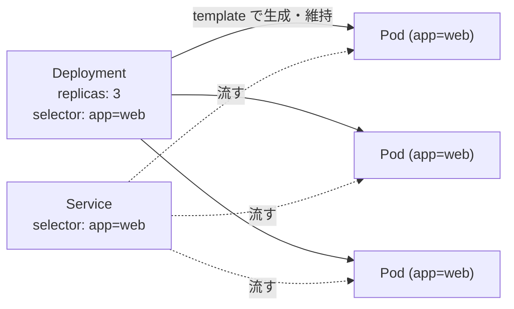
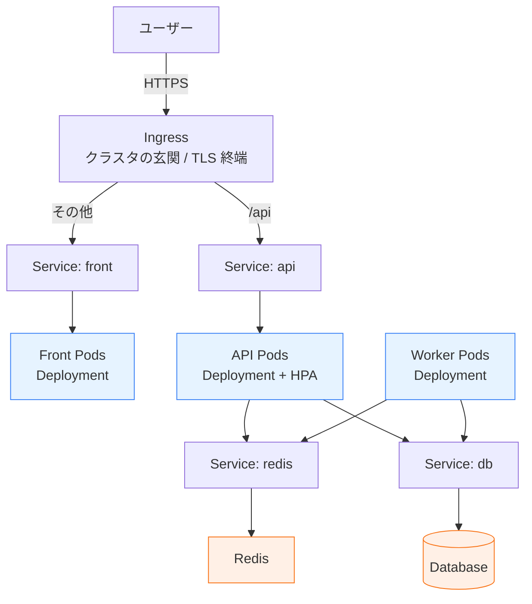

## この記事について

`docker run` も `docker compose up` も、手元で動かす分には何となく使えている。でも Kubernetes（以下 K8s）の話になると、Pod だの Deployment だの kubectl だのが急に降ってきて、「で、これは Docker と何が違って、自分たちは使うべきなの？」が一向に像を結ばない——この記事はそういう人のためのものです。

ゴールは次の 4 つです。前半 3 つを言語化でき、最後の 1 つができるようになることを目指します。

- **K8s が解決している問題**は何か（Docker のどこに穴が空くのか）
- **Docker との類似点と決定的な相違点**は何か（代替なのか、別物なのか）
- **自分たちは使うべきか**をどう判断するか
- **実際のマニフェスト（設定ファイル）YAML を開いたとき、各行が何のための行かを推測できる**

クラスタ構築の手順には深入りしませんが、マニフェストについては「ゼロから書ける」一歩手前——「読んで意味が推測できる」ところまで踏み込みます。狙うのは、概念の地図と、それを実際の YAML に重ねて読むための最小限の語彙です。

## なぜ Docker だけでは足りなくなるのか

Docker は本質的に「**1 台のマシンの上でコンテナを動かす**」道具です。手元の開発や、サーバ 1 台で完結するアプリなら、これで十分に回ります。

問題は本番運用に乗せた瞬間です。`docker run` は「今このコンテナを起動しろ」という**命令**を一度実行するだけで、その後の状態までは管理しません。具体的には、次のようなことを誰か（＝あなた）が手作業で見張る前提になっています。

- コンテナがクラッシュしたら、**誰が再起動する**のか
- サーバが 1 台まるごと落ちたら、そこで動いていたコンテナを**どこで動かし直す**のか
- 負荷に応じて同じコンテナを 3 個 → 10 個に**増やす/減らす**のは誰がやるのか
- 新バージョンに**無停止で差し替える**にはどうするのか
- コンテナは増えたり消えたりするのに、**アクセス先（IP）をどう一定に保つ**のか

Compose を使えば「複数コンテナの起動順や依存」までは宣言できますが、それでも対象は基本 1 ホストですし、「落ちたら自動で別マシンへ」「無停止で更新」までは対応しません。

つまり、コンテナが増え、マシンが増え、止められなくなるほど、**「手順を実行する人間」がボトルネック**になります。この「人間がやっていた運用判断」を仕組みに肩代わりさせるのが K8s です。

## Kubernetes の本質は「命令」ではなく「望ましい状態への収束」

ここが最初にして最大の概念的ジャンプです。多くの入門記事が用語から入りますが、本質はもっとシンプルで、一文に集約できます。

> **K8s には「望ましい状態（desired state）」を書く。あとは K8s が現状をそこへ寄せ続ける。**

公式ドキュメントの表現がこの思想を端的に言い表しています。

> In fact, it eliminates the need for orchestration. The technical definition of orchestration is execution of a defined workflow: first do A, then B, then C. In contrast, Kubernetes comprises a set of independent, composable control processes that continuously drive the current state towards the provided desired state.
> （[Kubernetes Documentation - Overview](https://kubernetes.io/docs/concepts/overview/) より）

意訳すると——「Kubernetes はオーケストレーション（A をやって B をやって C をやれ、という手順実行）ではない。むしろその必要をなくす。独立した制御プロセス群が、**現状を、与えられた望ましい状態へと継続的に寄せ続ける**だけだ」。

Docker と並べると違いがくっきりします。

| | 何を書くか | 比喩 |
|---|---|---|
| `docker run ...` | **命令**: 「今これを起動しろ」 | 一回きりの指示 |
| K8s マニフェスト | **状態の宣言**: 「常に 3 つ動いていてほしい」 | 維持してほしい目標 |

「3 つ動いていてほしい」と宣言しておけば、1 つ落ちて 2 つになった瞬間、制御プロセスが差分に気づいて 1 つ起動し直し、3 つに戻します。これが**自己修復（self-healing）**の正体で、魔法ではなく「宣言された状態と現状の差分を埋め続けるループ（reconciliation）」が回っているだけです。

実際、公式は「Pod が落ちたときや、Node ごと落ちたときに、controller がそれに気づいて自動で回復させる」と説明しています（[Pods](https://kubernetes.io/docs/concepts/workloads/pods/)）。人手で `docker run` を打ち直す代わりに、ループが差分を埋め続ける、というわけです。

この「宣言的（declarative）」という発想さえ腹落ちすれば、以降の用語は全部その上に乗っているだけだと分かります。

## Docker との関係を正しく理解する

ここでよくある誤解を先に整理しておきます。**「K8s は Docker の代わり（後継）」ではありません。** レイヤーが違うのです。

- **Docker**: イメージをビルドし、1 台でコンテナを動かす「開発者向けツール」
- **K8s**: 多数のコンテナを、多数のマシンにまたがって運用する「上位の運用基盤」

混乱の元は、「Docker」という言葉が単一の物を指していないことにあります。公式ブログ [Don't Panic: Kubernetes and Docker](https://kubernetes.io/blog/2020/12/02/dont-panic-kubernetes-and-docker/) がここを見事に解きほぐしています。

> the thing we call "Docker" isn't actually one thing—it's an entire tech stack, and one part of it is a thing called "containerd," which is a high-level container runtime by itself.

意訳すると——「我々が『Docker』と呼んでいるものは、実際には一つの物ではなく技術スタック全体であり、その一部に高レベルのコンテナランタイムである『containerd』が含まれている」。そして Docker の魅力である使いやすい CLI などの **UX 部分は人間のためのものであり、K8s には不要**です（K8s が扱う対象であって、人間ではないため）。

だから K8s は、コンテナを実際に動かす部分（**コンテナランタイム**）として、Docker そのものではなく containerd や CRI-O を直接使うようになりました。歴史的には K8s は Docker を介在させるために `dockershim` という変換層を抱えていましたが、これは「もう一つ壊れうる部品」でしかなく、v1.24 で取り除かれ、**ランタイムとしての** Docker サポートは終了しています（あくまでコンテナを動かすエンジンとして、という限定であり、後述のとおりイメージのビルドツールとしての Docker は健在です）。

ここで多くの人が不安になりますが、結論は意外なほど穏当です。

> **`docker build` で作ったイメージは、これまで通り K8s クラスタでそのまま動く。**

イメージの形式（OCI イメージ）は標準化されているからです。Docker は今も「イメージを作る」「ローカルで開発する」ための有用なツールであり続けます。**Docker でビルドし、K8s で動かす**——これが両者の最も自然な関係です。「どちらか」ではなく「どの層の話か」だと捉えてください。

## 最小限の用語マップ

宣言的モデルさえ掴めば、登場人物は驚くほど少数で足ります。まずはこの 4 語だけ押さえれば全体像が見えます。

### Node — 仕事をする 1 台

実際にコンテナを動かす計算機です。仮想マシンでも物理マシンでも構いません。本番では複数台束ねますが、学習環境なら 1 台でも動きます（[Nodes](https://kubernetes.io/docs/concepts/architecture/nodes/)）。「Docker を入れていたサーバ」に相当する位置だと思えば近いです。

### Pod — スケジューリングの最小単位

K8s が動かす最小単位は、コンテナそのものではなく **Pod** です。Pod の中に通常 1 個（密結合なら複数）のコンテナが入ります。重要な性質が 2 つあります。

- Pod は**使い捨て（ephemeral）**。落ちる・作り直される・別の Node へ移ることが前提で、「特定の Pod が永続的に存在し続ける」と期待してはいけません。
- 各 Pod は**固有の IP** を持ちますが、作り直されれば変わります。

マニフェスト上では、内側のコンテナの `image`（どのイメージを動かすか）と `ports`（どのポートで listen するか）が、ちょうど `docker run` で指定していた情報に対応します。「コンテナを少しだけ包んだ封筒」と捉えれば十分です。

### Deployment — 「N 個保て」を宣言する係

先に述べた「望ましい状態」を実際に書く相手がこれです。「この Pod を常時 3 個動かしておけ」と宣言すると、Deployment（が背後で使う controller）が**個数の維持・無停止のローリング更新・障害時の自己修復**を引き受けます。あなたが Pod を一つひとつ手で起動することはありません。宣言するのは Deployment で、Pod はその結果として生成される、という関係です。マニフェスト上では `replicas`（何個保つか）・`template`（生成する Pod の設計図）・`selector`（どの Pod を自分の管理対象とみなすか）が中心的なフィールドになります。

### Service — 入れ替わる Pod 群への安定した入口

Pod は使い捨てで IP も変わる。では「このアプリにアクセスしたい」クライアントはどこを向けばいいのか？ それを解決するのが **Service** です。

> If you use a Deployment to run your app, that Deployment can create and destroy Pods dynamically. ... Pods are ephemeral resources.
> （[Service](https://kubernetes.io/docs/concepts/services-networking/service/) より）

意訳すると——「Deployment でアプリを動かすと、その Deployment は Pod を動的に生成・破棄する。……Pod は使い捨て（ephemeral）の存在だ」。だからこそ、流動する Pod 群の手前に固定された入口が要ります。

Service は「変動し続ける Pod 群」の前に立つ**安定した名前とアクセス先**を提供します（サービスディスカバリ）。しかも、そのためにアプリ側のコードを書き換える必要はありません。「Pod は雲のように流れていくが、Service という看板は動かない」とイメージしてください。マニフェスト上では `selector`（どの Pod 群に流すか）・`port`/`targetPort`（受けるポートと転送先）・`type`（公開範囲）が要点になります。

### （補足）誰が宣言を実現しているのか

上記の裏側には、クラスタ全体を統括する **control plane**（API サーバ・状態を保存する etcd・配置を決める scheduler・各種 controller）と、各 Node 上でそれを実行する **kubelet** がいます（[Cluster Components](https://kubernetes.io/docs/concepts/overview/components/)）。入門段階では「望ましい状態を受け取り、差分を埋め続ける頭脳と手足が分かれて存在する」とだけ知っておけば十分で、ここに深入りする必要はありません。

## マニフェストを読んでみる

ここまでの概念を、実際の YAML に重ねます。リソースの種類を問わず、**すべてのマニフェストが共通して持つ 4 つの枠**から押さえます。これさえ知っていれば、未知のリソースでも「どこに何が書いてあるか」の見当がつきます。

| フィールド | 役割 |
|---|---|
| `apiVersion` | リソースの種別・バージョン（例: Deployment は `apps/v1`、Service は `v1`）。リソースごとに決まった文字列だと捉えればよい |
| `kind` | リソースの種類（`Deployment` / `Service` / `Pod` …） |
| `metadata` | 名前やラベルなど、そのリソース自身に付ける情報 |
| `spec` | **望ましい状態**の本体。「どうあってほしいか」を書く中心部分 |

では、用語マップで挙げた Deployment と Service を実際に書いてみます。`myapp:1.0` というイメージのアプリを 3 つ動かし、安定した入口を 1 つ与える、という最小構成です。

```yaml
# Deployment: 「この Pod を 3 つ保て」を宣言する
apiVersion: apps/v1
kind: Deployment
metadata:
  name: web
spec:
  replicas: 3                  # 望ましい状態の「N」。常に 3 つ動かし続ける
  selector:
    matchLabels:
      app: web                 # template のラベルと一致する Pod を「管理対象」とみなす
  template:                    # ここから下が「生成する Pod の設計図」
    metadata:
      labels:
        app: web               # 生成される Pod に貼るラベル
    spec:
      containers:
        - name: web
          image: myapp:1.0       # docker run で指定していたイメージ
          ports:
            - containerPort: 80  # コンテナが listen するポート
```

```yaml
# Service: 流動する Pod 群への安定した入口
apiVersion: v1
kind: Service
metadata:
  name: web
spec:
  selector:
    app: web                 # このラベルを持つ Pod 群に流す
  ports:
    - port: 8080             # Service が受けるポート
      targetPort: 80         # 転送先（＝コンテナの containerPort）
  type: ClusterIP            # 公開範囲（このあと説明）
```

注目すべきは `selector` と `labels` の**ラベルによる結びつき**です。これがマニフェスト読解の最大の鍵になります。

- Deployment は `template` で **Pod にラベル（`app: web`）を貼り**、自分の `selector` で「そのラベルを持つ Pod を 3 つ保つ」と宣言する。
- Service は自分の `selector` で「`app: web` を持つ Pod に流す」と宣言する。

つまり Deployment と Service は別々の YAML でありながら、**同じラベルを指差すことで一つのアプリとして繋がっています**。IP でも名前でもなく、ラベルが接着剤です。



最後の `type` は Service の**公開範囲**を決めます。読むときに見分けがつく程度に 3 つだけ:

- `ClusterIP`（既定）: クラスタ内部からのみ届く。内部通信用。
- `NodePort`: 各 Node のポートを開けて外部からも届く。素朴な外部公開。
- `LoadBalancer`: クラウドのロードバランサ経由で外部公開。本番の外向きで多用。

### `docker run` のオプションは、マニフェストのどこに化けるか

Docker を触ってきたなら、`docker run` の引数との対応で見ると一気に腹落ちします。

| docker run | K8s マニフェスト上の対応 |
|---|---|
| イメージ指定（`myapp:1.0`） | `containers[].image` |
| `-p 8080:80` | コンテナ側 `containers[].ports.containerPort` ＋ 公開側 Service の `port` / `targetPort` |
| `-e KEY=val` | `containers[].env`（または ConfigMap / Secret 参照。後述） |
| `--memory` / `--cpus` | `containers[].resources`（後述） |
| `--name` | `metadata.name` |
| `--restart` | Deployment が自動で担う領域（明示不要） |

「`docker run` で渡していた情報が、宣言的な YAML のフィールドに散らばって書かれているだけ」——この見方ができれば、初見のマニフェストでも大筋を追えます。

### 実運用のマニフェストで出てくる、もう少しの語彙

入門段階で全部覚える必要はありませんが、実際の YAML を開くと頻出する要素を、用途だけ押さえておきます。「これは何のための行か」が分かれば、読むときに迷子になりません。

- **ConfigMap / Secret**: 設定値や接続情報を、コンテナ本体から切り離して持つ仕組み。`docker run -e` や env-file の発展形で、`env` / `envFrom` から参照されます。**Secret** はパスワードや API キーなど機密用の入れ物、という違いだけ押さえれば十分です。
- **liveness / readiness probe**: コンテナの**生存確認**（落ちていないか）と**受付準備確認**（リクエストを受けられる状態か）の 2 種。前者が失敗すると再起動され、後者が失敗すると Service の振り分け先から外されます。先に触れた自己修復は、この probe を判定材料にしています。
- **resources（requests / limits）**: コンテナに割り当てる CPU・メモリの**確保量（requests）**と**上限（limits）**。requests はスケジューラが「どの Node に置くか」を決める材料に、limits は使いすぎへの歯止めになります。
- **Namespace**: クラスタ内を論理的に仕切る区画。`metadata.namespace` で見かけます。チームや環境ごとにリソースを分けたいときに使います。

これらは「書けるようになる」必要はまだありません。**読んだときに「この行は機密設定だな」「これは死活監視だな」と当たりがつく**——本記事のゴールはそこまでです。

## Docker Compose を知っているなら、ここで地続きになる

Compose を触ったことがあるなら、実は K8s への距離は思ったより近いです。Compose の「サービス定義 YAML」と K8s の「マニフェスト YAML」は、**宣言的に欲しい構成を書く**という発想が共通しているからです。

イメージとしては、Compose のこの 1 ブロックが——

```yaml
services:
  web:
    image: myapp:1.0
    ports: ["8080:80"]
```

K8s では、先ほど読んだ **Deployment（Pod を何個保つかを書く）＋ Service（安定した入口を作る）** の 2 つに分かれて表現されます。同じ `myapp:1.0` を `8080:80` で公開する構成が、個数・更新戦略・複数ノード前提といった概念が加わるぶん項目が増え、2 つのリソースに展開される、という対応です。

公式も、Compose ファイルを K8s リソースへ変換するツール **Kompose** を案内しています（[Translate a Docker Compose File to Kubernetes Resources](https://kubernetes.io/docs/tasks/configure-pod-container/translate-compose-kubernetes/)）。

ただし**対応は 1:1 ではありません**。K8s 側には Compose に無い概念——先ほど触れた Service による抽象、ローリング更新、そもそも複数ノードに分散させる前提——が乗っています。Kompose はあくまで出発点であり、「Compose の発想のまま K8s が全部書ける」わけではない点には注意してください。それでも、「YAML で欲しい状態を宣言する」という共通の足場があることは、最初の理解を大きく助けてくれます。

## 実際のアプリ構成で見る Kubernetes の役割

ここまでは部品を一つずつ見てきました。最後に、それらが**一つのアプリとしてどう組み合わさり、その中で K8s が何を肩代わりするのか**を、現実に近い構成で俯瞰します。完全な本番構成を網羅するのが狙いではありません。「**K8s だからこそ楽になる部分**」に光を当てます。

### 題材 — 急なアクセス増がある Web サービス

題材として、こんなアプリを考えます。よくある「フロント＋API＋裏方処理＋データ置き場」の構成です。

- **フロントエンド**: ブラウザに HTML/JS を返す（または SPA を配信する）。ステートレス。
- **API サーバ**: フロントからのリクエストを処理する本体。ステートレス。
- **非同期ワーカー**: 画像変換やメール送信など、時間のかかる処理をキュー経由で裏で回す。ステートレス。
- **データベース**: 注文やユーザ情報を永続化する。**ステートフル**（状態＝データを持つ）。
- **キュー / キャッシュ（Redis 等）**: ワーカーへの仕事の受け渡しや一時データの保持。

ユースケースとしては「**普段は穏やかだが、セールやテレビ露出で突発的にアクセスが跳ねる**」状況を想定します。EC でもメディアでも、この「平常時と急増時の落差」こそ、K8s の価値が最も分かりやすく出る典型です。



青く塗ったフロント・API・ワーカーが**ステートレス**、橙の Redis・DB が**ステートフル**です。この色の違いが、後で効いてきます。

### このアプリが本番で「人手」を食う場所

Docker だけでこれを運用すると、「なぜ Docker だけでは足りなくなるのか」で挙げた問題が、一気に具体化します。

- セールが始まって API への負荷が急増 → 誰かが**手で API コンテナを増やす**
- 深夜に API コンテナが 1 つクラッシュ → 誰かが**気づいて再起動する**
- 新バージョンをリリース → **無停止で差し替える**手順を人がやる
- フロントもワーカーも同様に、個数管理・障害対応・更新が**全部手作業**
- API も DB も Pod の入れ替わりで IP は変わりうる → **接続先をどう一定に保つ**か

並べてみると分かるのは、これらが「アプリのロジック」ではなく、すべて「**運用の判断と手順**」だということです。K8s はまさにこの部分を、宣言で肩代わりします。

### K8s は、どの機能でこれを解くか

各コンポーネントに「望ましい状態」を宣言するだけで、先ほどの手作業が機構に置き換わります。

| コンポーネント | 使う主なリソース | K8s が肩代わりすること |
|---|---|---|
| フロント / API / ワーカー | **Deployment** | 個数維持・自己修復・無停止のローリング更新 |
| 各サービスへの内部入口 | **Service (ClusterIP)** | 入れ替わる Pod 群への安定した接続先 |
| 外部からの入口 | **Ingress** | HTTP のルーティング・TLS 終端を 1 か所に集約 |
| 急増時のスケール | **HorizontalPodAutoscaler** | 負荷に応じた Pod 数の自動増減 |
| 設定・機密 | **ConfigMap / Secret** | DB 接続情報や API キーをコードから分離 |

注目すべきは、ステートレスな三層（フロント・API・ワーカー）が**そろって同じ Deployment + Service のパターンで書ける**ことです。役割は違っても「使い捨ての Pod を N 個保ち、安定した入口を与える」という構造は共通で、用語マップで見た知識がそのまま 3 回使い回せます。

そして、この題材で K8s がとりわけ輝くのが **HPA（HorizontalPodAutoscaler）** です。冒頭で挙げた「負荷に応じて同じコンテナを 3 個 → 10 個に増やす/減らすのは誰がやるのか」への答えが、これです。

```yaml
# HorizontalPodAutoscaler: 「負荷に応じて API の Pod 数を自動で増減せよ」
apiVersion: autoscaling/v2
kind: HorizontalPodAutoscaler
metadata:
  name: api
spec:
  scaleTargetRef:            # どの Deployment を増減対象にするか
    apiVersion: apps/v1
    kind: Deployment
    name: api
  minReplicas: 3             # 最小（平常時もこれは保つ）
  maxReplicas: 20            # 最大（増えすぎへの歯止め）
  metrics:
    - type: Resource
      resource:
        name: cpu
        target:
          type: Utilization
          averageUtilization: 50   # CPU 使用率がこの辺りに収まるよう調整
```

ここに書いてあるのも、命令ではなくやはり**望ましい状態**です——「CPU 使用率がだいたい 50% に収まるように、Pod 数を 3〜20 の範囲で保て」。あとは K8s が現状の負荷を見て、その範囲で個数を増減し続けます（[HorizontalPodAutoscaler](https://kubernetes.io/docs/tasks/run-application/horizontal-pod-autoscale/)）。セールが始まれば勝手に増え、終われば勝手に減る。本記事の冒頭で置いた「宣言された状態へ収束し続けるループ」が、ここでも同じ顔で働いているだけです。

外部からの入口を束ねる **Ingress** も、複数サービスを持つアプリで効きます。「`/api` は API の Service へ、それ以外はフロントの Service へ」といった HTTP ルーティングや、TLS 証明書の終端を 1 か所に集約できます（[Ingress](https://kubernetes.io/docs/concepts/services-networking/ingress/)）。Service が「個々のアプリの入口」なら、Ingress は「クラスタ全体の玄関」にあたる、と捉えると関係が見えます。

### 注意点 — 「全部 K8s に載せる」必要はない

ここで、図で**色を分けた意味**に立ち返ります。青いフロント・API・ワーカーは**ステートレス**で、落ちても作り直せばよく、何個に増やしても等価です。だから Deployment との相性が抜群で、上で見た強みが素直に効きます。

一方、橙の **データベース**は話が別です。状態（データ）を持つため、「使い捨て・どこで動かしても同じ」という Pod の前提と真っ向からぶつかります。K8s にも StatefulSet や PersistentVolume という、状態を持つワークロード向けの仕組みはあります（[StatefulSet](https://kubernetes.io/docs/concepts/workloads/controllers/statefulset/)）。しかし、**バックアップ・フェイルオーバー・レプリケーションまで含めて DB を K8s 上で正しく運用する難しさは、本記事の範囲を大きく超えます**。

現実には、「**ステートレスな部分は K8s に、DB はマネージドサービス（RDS / Cloud SQL など）に逃がす**」という割り切りが広く採られます。これは妥協ではなく、次章「使うべきか」で問う「そもそも K8s でなくてよいのでは？」を、コンポーネント単位で実践したものです。K8s が得意な「使い捨てを大量に・無停止で・自動で」回す部分にだけ使い、状態管理という難所は専用サービスに任せる——この線引きこそ、構成を考えるときの肝になります。

そして繰り返しになりますが、これは**完全な構成ではありません**。実運用では監視・ログ収集・CI/CD・ネットワークポリシー・権限管理などがさらに乗ります。ここで見たのは、あくまで「K8s が運用判断を肩代わりする中心部分」だけです。それでも、ステートレスな三層が同じパターンで書け、そこに HPA と Ingress が乗るだけで「急増に耐える Web サービス」の骨格になる——この見通しが立てば、K8s の強力さの輪郭はかなり掴めているはずです。

## 使うべきか — 判断軸

K8s は強力ですが、**強力さと過剰さは紙一重**です。

### Kubernetes が効くケース

ここまでを踏まえると、効く条件は明確です。「複数台・無停止・自己修復・スケール」を**仕組みとして**欲しいときです。

- サービスやコンテナの数が多く、手作業の運用が破綻し始めている
- 可用性要件があり、1 台落ちても止められない
- デプロイ頻度が高く、無停止のローリング更新を標準化したい
- 「宣言的に書いて差分を埋め続ける」運用へ移行する意思がチームにある

### 過剰になりやすいケース

逆に、次のような状況では K8s はオーバーキルになりがちです。

- **1 台のサーバで足りている**（複数ノード前提の機構が丸ごと不要）
- トラフィックが小さい、または予測可能で、動的なスケールが要らない
- 運用に割ける人員が薄い

最後の点は特に重要です。公式の落とし穴集（[7 Common Kubernetes Pitfalls](https://kubernetes.io/blog/2025/10/20/seven-kubernetes-pitfalls-and-how-to-avoid/)）の結びが本質を突いています。

> Kubernetes is amazing, but it's not psychic, it won't magically do the right thing if you don't tell it what you need.

意訳すると——「Kubernetes は素晴らしいが、超能力者ではない。何が必要かを伝えなければ、勝手に正しく振る舞ってはくれない」。

K8s は「望ましい状態」を**正しく教えなければ正しく動かない**仕組みです。裏を返せば、その「正しく教える」ための学習コストと運用コストが、現実に重くのしかかります。同記事には、小さな内部アプリに Istio（サービスメッシュ）を入れた結果「アプリ本体より Istio 自体のデバッグに時間を費やした」、ハッカソン後にロードバランサを消し忘れて 3 週間課金され続けた、といった具体的な失敗談が並びます。**機能が多いことは、誤用と運用負荷の余地が多いこと**でもあるのです。

加えて、公式の Overview は「K8s はマシン自体の構成管理やメンテナンスまでは扱わない」とも明言しています（[Overview](https://kubernetes.io/docs/concepts/overview/) の "What Kubernetes is not"）。K8s は万能の運用自動化ではなく、あくまで**コンテナ化されたワークロードの運用層**だと境界を理解しておくべきです。

### マネージドと代替の位置づけ

「自前でクラスタを組むのが大変」という負荷の一部は、EKS / GKE / AKS といったマネージド K8s でクラウド側に寄せられます。control plane の運用などを肩代わりしてくれるぶん、入り口の負担は確実に下がります。ただし**複雑性がゼロになるわけではない**——マニフェスト設計、ネットワーク、権限、コスト管理といった本質的な難しさは手元に残ります。

そして判断の最後に置くべき問いは「**そもそも K8s でなくてよいのでは？**」です。

- 1 マシンで完結するなら **Docker Compose** で十分なことは多い
- 「落ちたら再起動」程度なら、ランタイムの再起動ポリシーや軽量な PaaS で足りる場合もある

「みんな使っているから」ではなく、「**手作業の運用が本当に限界に来ているか**」で選ぶのが健全です。

## まとめと最初の一歩

要点を整理します。

- K8s の本質は、**宣言した「望ましい状態」を維持し続ける運用基盤**。命令を一回実行する `docker run` とは発想が逆。
- Docker の**代替ではなく上位レイヤー**。"Docker"（実体は containerd を含むスタック）でビルドしたイメージを、K8s が多数のマシンで運用する。両者は共存する。
- 用語は **Node / Pod / Deployment / Service** の 4 語からで十分。残りはその上に乗る。
- マニフェストは **`apiVersion` / `kind` / `metadata` / `spec`** の 4 つの枠と、**ラベルによる Deployment・Service・Pod の結びつき**を掴めば、各行の意図が推測できる。
- 使うかどうかは、**「複数台・無停止・自己修復・スケール」を仕組みで欲しいか**で決める。要らないなら過剰で、学習・運用コストが現実に乗る。

最初の一歩は、いきなり本番クラスタを組むことではありません。手元の **Docker Desktop に付属する Kubernetes**（[Docker Docs](https://docs.docker.com/desktop/use-desktop/kubernetes/)）や **minikube** で、1 ノードのローカルクラスタを立て、`kubectl` で Deployment を 1 つ宣言してみる。Pod を手動で削除しても自動的に復活する——その「差分が埋まる」瞬間を一度体感すれば、ここまで読んだ概念が一気に像を結ぶはずです。

公式の [Learn Kubernetes Basics](https://kubernetes.io/docs/tutorials/kubernetes-basics/) が、その体験への素直な入り口になっています。
