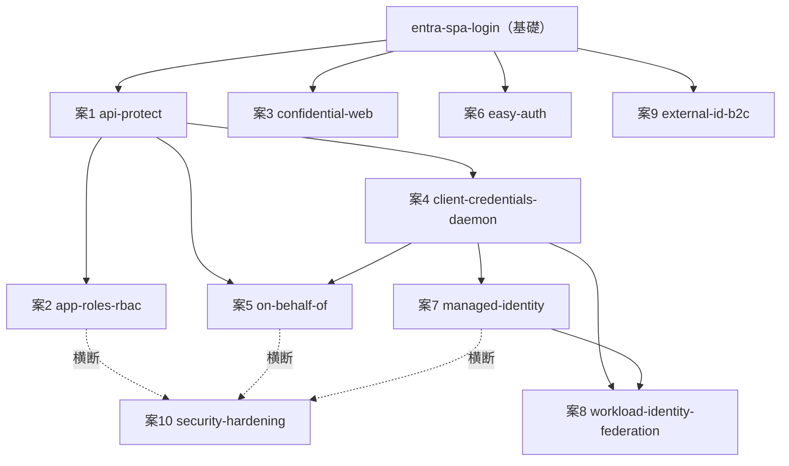

# auth — この先のプロジェクト候補（PLAN）

最初のプロジェクト `entra-spa-login` で、**認証の最小ループ**（SPA からログイン → ID トークンでユーザーを知る → アクセストークンで既製 API を消費）と、その背後の一般概念（OAuth2/OIDC の登場人物・2 種のトークン・パブリッククライアントと PKCE・リダイレクト URI）を一通り通した。

この PLAN は、その土台のうえで **`entra-spa-login` がスコープ外として切った領域** ―― 自前 API の保護・認可（誰が何をしてよいか）・ユーザー不在の認証・シークレットレス・コンシューマ ID ―― へ広げる候補をまとめる。**実装詳細には踏み込まず、「どの概念を、何と対比して掴むか」** に集中する。

## このフェーズの方針

- **まず一般概念、次に Entra 実装。** どの案も「認証・認可の一般論としてどんな問題を解くか」を先に置き、Entra の機能（Expose an API・App Roles・Managed Identity 等）はその実現例として扱う。
- **`entra-spa-login` を共通の起点にする。** どの案も「あの最小ループの何を 1 つ増やす／入れ替えるか」で位置づける（例：クライアントを入れ替える／リソースサーバー側を足す／ユーザーを外す／秘密を消す）。
- **設定を出し入れして因果を確かめる**学び方は learn/network と同じ。トークンの `aud`/`scp`/`roles` を見比べ、許可・ロール・資格情報を出し入れして「効いているもの」を切り分ける。

## 案一覧

各案に **レベル（★＝最小ループ直後でも入りやすい／★★＝中／★★★＝発展）**、**依存（前提プロジェクト）**、**解く問題（一般）**、**Entra での学び**、**掴む概念**を併記する。番号は優先度ではなく識別用。

---

### 案1. 自前 API を守る ―― リソースサーバー側を初めて作る（api-protect）

- **レベル**：★
- **依存**：entra-spa-login
- **解く問題（一般）**：認証は「誰か」を確かめるだけ。実際の価値は「**保護された API を、正しいトークンを持つ相手にだけ使わせる**」こと。これまで「クライアント側」だけだったのに対し、初めて「**リソースサーバー側**」を作る。
- **Entra での学び**：「Expose an API」で自前の委任スコープ（例 `access_as_user`）を定義し、SPA がそのスコープを要求、API 側が受け取ったトークンの**署名・`aud`（宛先）・`scp`（スコープ）**を検証する。
- **掴む概念**：リソースサーバー、委任スコープ、トークン検証（誰が・何のために発行し・誰宛か）、Bearer。`entra-spa-login` で Graph 宛だったアクセストークンを「**自前 API 宛**」に作り替える、最初の自然な続き。

### 案2. 認証から認可へ ―― ロールで「何をしてよいか」を変える（app-roles-rbac）

- **レベル**：★★
- **依存**：案1（api-protect）
- **解く問題（一般）**：**認証（誰か）と認可（何をしてよいか）は別物**。同じログインユーザーでも、役割によって出来ることを変えたい。
- **Entra での学び**：App Roles（アプリが定義する役割）やグループのクレームをトークンに乗せ、`roles` クレームで API／画面を出し分ける。
- **掴む概念**：RBAC、**スコープ（`scp`）とロール（`roles`）の違い**（前者は「アプリが要求した操作範囲」、後者は「主体に割り当てられた役割」）、クレームベース認可。ロールを出し入れして同じユーザーの可否が変わることを確かめる。

### 案3. パブリックからコンフィデンシャルへ ―― サーバーで秘密を持つ（confidential-web）

- **レベル**：★★
- **依存**：entra-spa-login（対比）
- **解く問題（一般）**：SPA はソースが丸見えで**秘密を持てなかった（パブリッククライアント）**。サーバーサイド Web アプリなら秘密（シークレット／証明書）を秘匿でき、トークンをブラウザに晒さずサーバーで扱える（BFF）。
- **Entra での学び**：コンフィデンシャルクライアントとしてのアプリ登録、クライアントシークレット／証明書、Authorization Code Flow をサーバーで完結。
- **掴む概念**：**パブリック vs コンフィデンシャルクライアント**、BFF（Backend for Frontend）、資格情報（シークレット／証明書）、「トークンをブラウザに置かない」設計。`entra-spa-login` の「PKCE で秘密なし」と正面から対比する。

### 案4. ユーザーのいない認証 ―― アプリ自身として動く（client-credentials-daemon）

- **レベル**：★★
- **依存**：案1（api-protect）
- **解く問題（一般）**：これまで全て「**ユーザーがログインする**」前提だった。バッチ／デーモンには人間がいない。アプリ自身の資格情報で動く。
- **Entra での学び**：Client Credentials Flow、**アプリケーション許可（application permission）と委任許可（delegated permission）の違い**、管理者同意。
- **掴む概念**：**委任 vs アプリケーション許可**（「ユーザーの代理」か「アプリそのもの」か）、ユーザーコンテキストの有無、管理者同意。`entra-spa-login` の「ユーザーが同意して委任」と対比。

### 案5. トークンを引き継ぐ ―― 多段 API でアイデンティティを伝播（on-behalf-of）✅ 実装済み

- **レベル**：★★★
- **依存**：案1（api-protect）／案4 の概念
- **状態**：`./on-behalf-of` に作成済み（SPA → 中間 API(A) → 下流 API(B)。chain-naive=生転送で 401／chain-obo=OBO 交換で 200 の対比、`task consent`/`revoke-consent` で A→B 委任同意を出し入れ）。詳細は [auth/CLAUDE.md](./CLAUDE.md)
- **解く問題（一般）**：API A がユーザーのトークンを受け、さらに下流の API B を「**そのユーザーとして**」呼びたい。受け取ったトークンはそのまま転送できない（`aud` が違う）。
- **Entra での学び**：On-Behalf-Of Flow（トークン交換）。
- **掴む概念**：トークンの **`aud` 境界**、トークン交換、多段呼び出しでのアイデンティティ伝播。案1 で「`aud` を検証する」ことがなぜ重要だったかが、ここで効いてくる。

### 案6. 認証を基盤に任せる ―― コードを書かないログイン（easy-auth）

- **レベル**：★
- **依存**：entra-spa-login（対比）
- **解く問題（一般）**：認証コードを自分で書かず、**ホスティング基盤に肩代わり**させる。
- **Entra/Azure での学び**：App Service の組み込み認証（Easy Auth）で、コードを書かずに `entra-spa-login` 同等のログインを実現する。
- **掴む概念**：**自前実装 vs プラットフォーム実装**のトレードオフ（手軽さ・制御の細かさ・移植性）、リバースプロキシ型認証。Bicep で構築でき、auth 領域の既定技術（Bicep/just/CLI）に回帰する案でもある。

### 案7. 秘密を消す（Azure 内）―― 資格情報を基盤に管理させる（managed-identity）

- **レベル**：★★
- **依存**：案4 の概念
- **解く問題（一般）**：案4 のクライアントシークレットは「**管理・漏洩・ローテーション**」の重荷。Azure 上のリソースなら、資格情報を Azure に持たせて**消せる**。
- **Entra/Azure での学び**：Managed Identity（システム割り当て／ユーザー割り当て）で Key Vault・Storage・自前 API へアクセス。
- **掴む概念**：**シークレットの排除**、ワークロードのアイデンティティ、対象リソースへの最小権限 RBAC 割り当て。案4 の「シークレットで動くデーモン」を「シークレットを持たないデーモン」に置き換える。Bicep が主役になる案。

### 案8. 秘密を消す（Azure 外）―― 外部から信頼でつなぐ（workload-identity-federation）

- **レベル**：★★★
- **依存**：案4／案7 の概念
- **解く問題（一般）**：Azure の**外**（CI/CD・他クラウド）からも、シークレットを置かずに Entra に対して認証したい。
- **Entra での学び**：フェデレーション資格情報（外部 OIDC IdP、例：GitHub Actions の信頼）。
- **掴む概念**：**信頼の連鎖**（外部 IdP のトークン → Entra のトークン）、OIDC フェデレーション、CI/CD のシークレットレス。案7 の「Azure 内のシークレットレス」を「Azure 外のシークレットレス」へ拡張。

### 案9. 対象ユーザーを社員から消費者へ ―― サインアップとソーシャルログイン（external-id-b2c）

- **レベル**：★★★
- **依存**：entra-spa-login
- **解く問題（一般）**：これまでは**組織のメンバー（workforce）**が対象だった。一般消費者（toC）は**サインアップ・ソーシャルログイン・プロフィール収集**が要る。
- **Entra での学び**：Entra External ID（旧 Azure AD B2C）、ユーザーフロー、ローカル／ソーシャルアカウント。
- **掴む概念**：**workforce vs external（consumer）identity**、サインアップフロー、外部 ID プロバイダのフェデレーション。`entra-spa-login` のログイン体験を「自テナントの社員」から「不特定の消費者」へ広げる。

### 案10. 作り込みと締め付け ―― 条件付きアクセス・トークン寿命・証明書（security-hardening）

- **レベル**：★★★
- **依存**：複数案を通した後の横断
- **解く問題（一般）**：「ログインできる／API を呼べる」の先で、**いつ・どんな条件なら許すか**を締める。
- **Entra での学び**：条件付きアクセス（場所・デバイス）、トークン有効期間、継続的アクセス評価（CAE）、シークレットから証明書資格情報への移行。
- **掴む概念**：ポリシーベースの認可、トークンのライフサイクル、資格情報の強度。各案で作った構成に対する「運用・セキュリティの作り込み」として最後に当てる。

---

## 依存関係（ざっくり）

## おすすめの進め方

最小ループからの距離・依存を踏まえ、次の 4 グループに分けて進めるのがおすすめ。

1. **リソース保護と認可（★→★★）**：案1（api-protect）→ 案2（app-roles-rbac）
   - `entra-spa-login` の直接の続き。「クライアント → リソースサーバー → 認可」と、認証の次に必ず来る土台を固める。最優先。
2. **クライアント種別を広げる（★★→★★★）**：案3（confidential-web）・案4（client-credentials-daemon）→ 案5（on-behalf-of）
   - 「**誰が・どこで認証するか**」のバリエーション。public/confidential、ユーザー有/無、トークンの引き継ぎ。
3. **シークレットレス & プラットフォーム（★→★★★）**：案6（easy-auth）→ 案7（managed-identity）→ 案8（workload-identity-federation）
   - 「**資格情報をいかに持たない／書かないか**」。Bicep が主役に戻るグループ。
4. **対象ユーザーと作り込み（★★★）**：案9（external-id-b2c）・案10（security-hardening）
   - 消費者向け ID への拡張と、全体に対する運用・セキュリティの締め。

> どの案も「まず一般概念 → Entra 実装」「設定を出し入れして因果を確かめる」という共通の学び方を踏襲する。構築・実行はユーザー自身が行い、AI が Azure 上で実行することはない。
