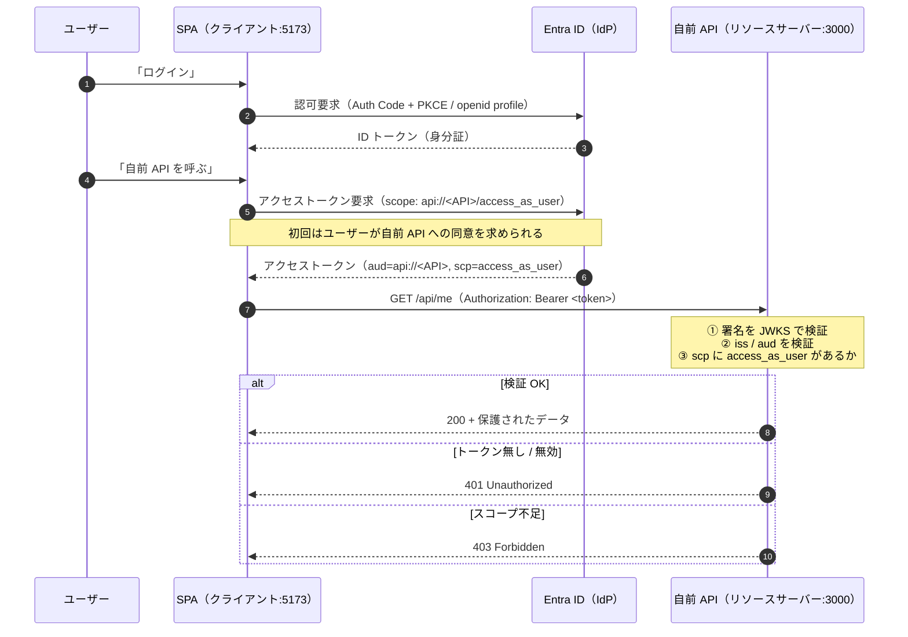
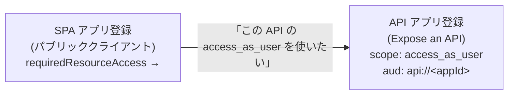
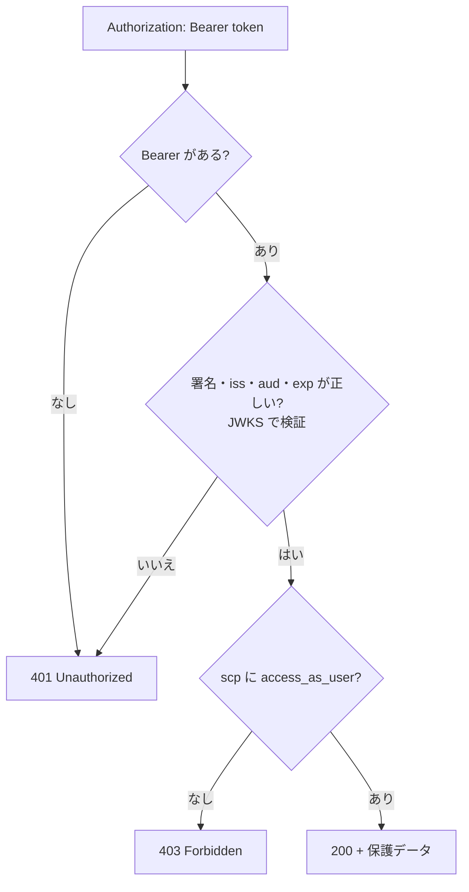

# 認証フロー / 構成（mermaid）

`entra-spa-login` との違いは、最後に **自前 API（リソースサーバー）がトークンを検証する** 段が増えたこと。

## 全体フロー

```mermaid
sequenceDiagram
    autonumber
    participant U as ユーザー
    participant SPA as SPA（クライアント:5173）
    participant IdP as Entra ID（IdP）
    participant API as 自前 API（リソースサーバー:3000）

    U->>SPA: 「ログイン」
    SPA->>IdP: 認可要求（Auth Code + PKCE / openid profile）
    IdP-->>SPA: ID トークン（身分証）

    U->>SPA: 「自前 API を呼ぶ」
    SPA->>IdP: アクセストークン要求（scope: api://<API>/access_as_user）
    Note over SPA,IdP: 初回はユーザーが自前 API への同意を求められる
    IdP-->>SPA: アクセストークン（aud=api://<API>, scp=access_as_user）

    SPA->>API: GET /api/me（Authorization: Bearer <token>）
    Note over API: ① 署名を JWKS で検証<br/>② iss / aud を検証<br/>③ scp に access_as_user があるか
    alt 検証 OK
        API-->>SPA: 200 + 保護されたデータ
    else トークン無し / 無効
        API-->>SPA: 401 Unauthorized
    else スコープ不足
        API-->>SPA: 403 Forbidden
    end
```

## アプリ登録の関係（2 つに分かれる）

```mermaid
graph LR
    spaApp["SPA アプリ登録<br/>(パブリッククライアント)<br/>requiredResourceAccess →"]
    apiApp["API アプリ登録<br/>(Expose an API)<br/>scope: access_as_user<br/>aud: api://&lt;appId&gt;"]
    spaApp -- 「この API の access_as_user を使いたい」 --> apiApp
```

## トークン検証の中身（api/server.js）

```mermaid
flowchart TD
    A[Authorization: Bearer token] --> B{Bearer がある?}
    B -- なし --> E401[401 Unauthorized]
    B -- あり --> C{署名・iss・aud・exp が正しい?<br/>JWKS で検証}
    C -- いいえ --> E401
    C -- はい --> D{scp に access_as_user?}
    D -- なし --> E403[403 Forbidden]
    D -- あり --> OK[200 + 保護データ]
```
