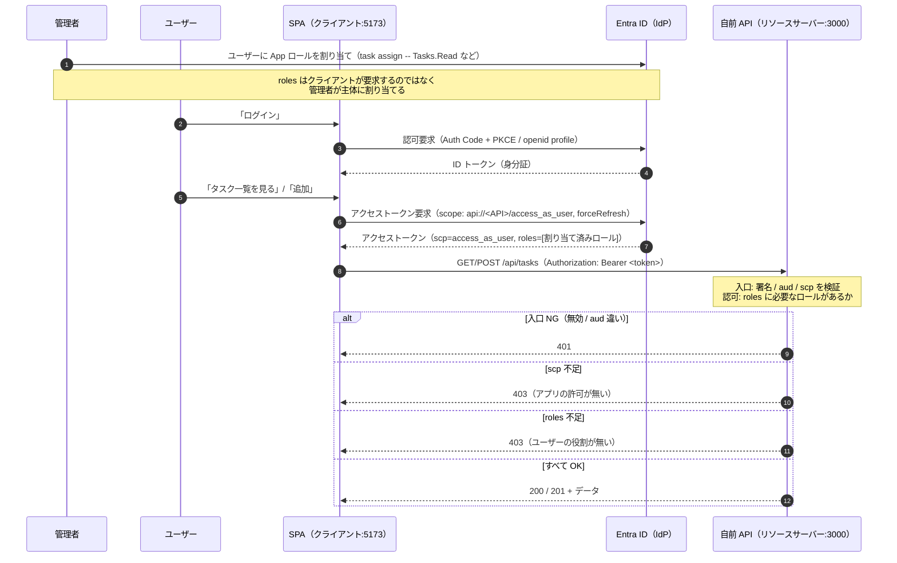
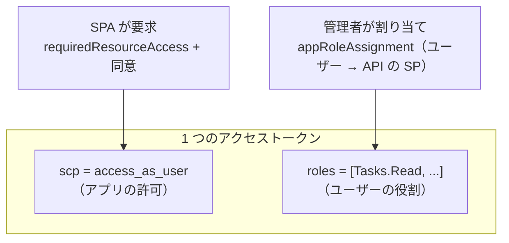
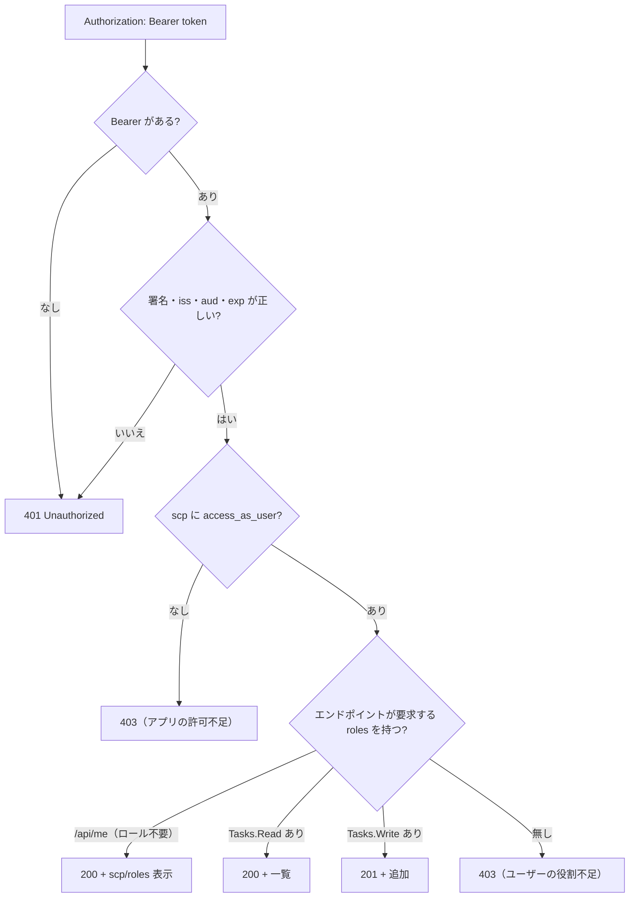

# 認可フロー / 構成（mermaid）

`api-protect` との違いは、API がトークンを受け取ったあと **`roles` クレームでエンドポイント別の認可**を行う段が増えたこと。そして `roles` の出どころが「クライアントの要求」ではなく「**管理者によるユーザーへのロール割り当て**」である点。

## 全体フロー（認証 → 認可）

## scp と roles の出どころ（別レイヤー）

## API の判定（api/server.js）

