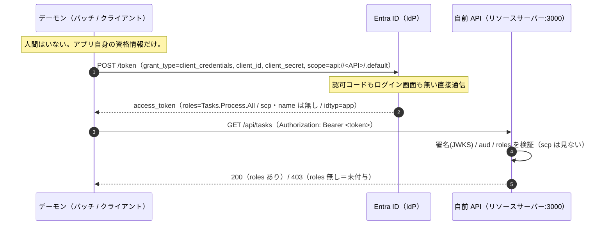
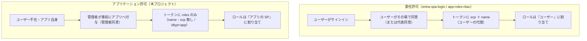
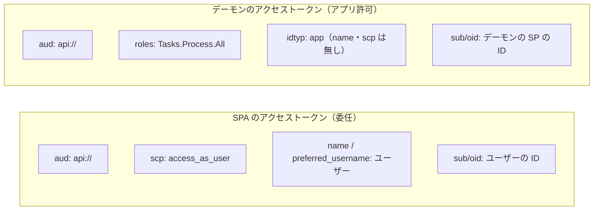
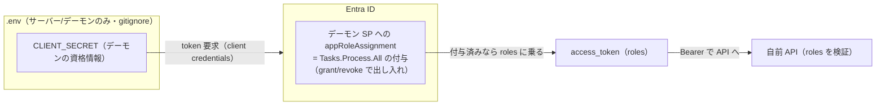

# 認証フロー / 構成（mermaid）

`entra-spa-login` との違いは、**ユーザーも認可コードもリダイレクトも無く、アプリ自身がシークレットだけでトークンを取る**こと。届くトークンには `scp`・`name` が無く `roles` だけがある。

## 全体フロー（Client Credentials Flow）

## 委任（これまで）↔ アプリケーション許可（本プロジェクト）の対比

## トークンの中身の違い（誰として動いているか）

## どこに何が在るか（資格情報の所在）

