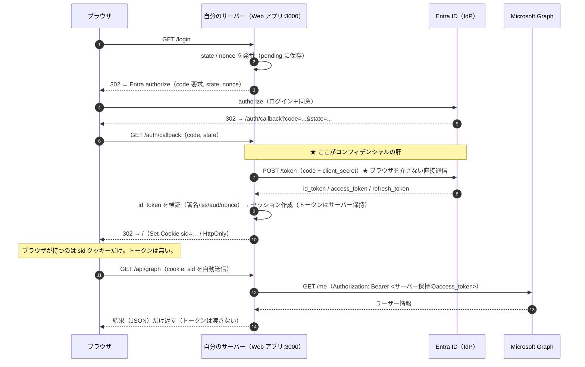
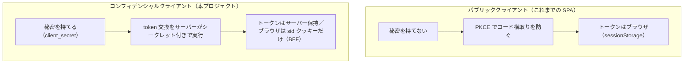
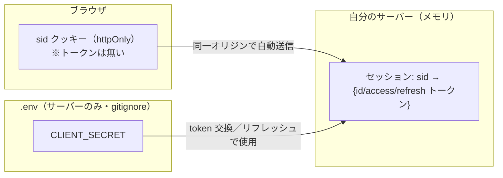

# 認証フロー / 構成（mermaid）

`entra-spa-login` との違いは、**トークン交換をサーバーがクライアントシークレット付きで行い、トークンをブラウザに渡さない**こと。ブラウザが持つのは `sid` クッキーだけ（BFF）。

## 全体フロー（認可コードフローをサーバーで完結）

## パブリック（SPA）↔ コンフィデンシャル（Web）の対比

## どこに何が在るか（トークンの所在）

