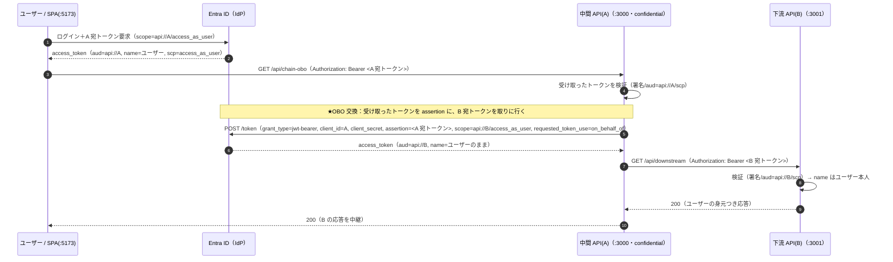
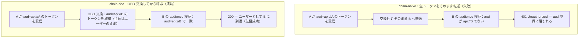
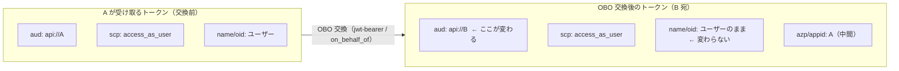
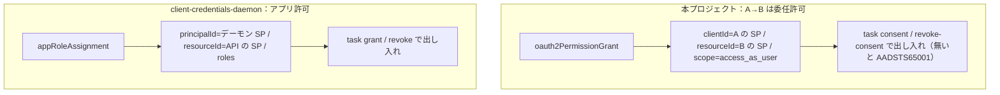

# 認証フロー / 構成（mermaid）

これまでとの違いは、**API が 2 段**になり、トークンが段ごとに**作り替えられて**伝わること。A が受け取るトークンは `aud=api://A`、B が受け入れるのは `aud=api://B`。その差を埋めるのが On-Behalf-Of(OBO) 交換。

## 全体フロー（SPA → 中間 API(A) → 下流 API(B)）

## naive 転送（失敗）↔ OBO 交換（成功）の対比

## トークンの aud と主体の変化（交換の前後）

## 同意の置き場所の対比（委任 ↔ アプリ許可）

