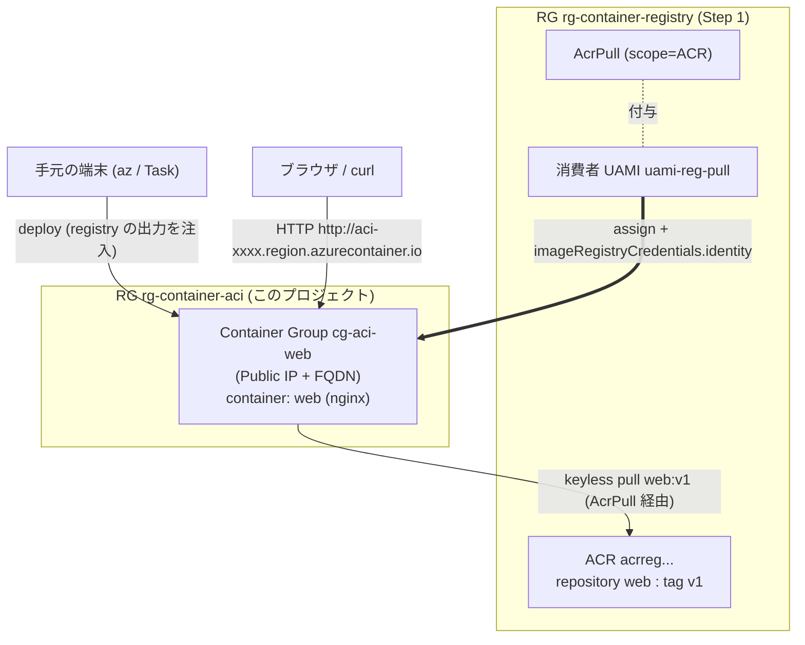
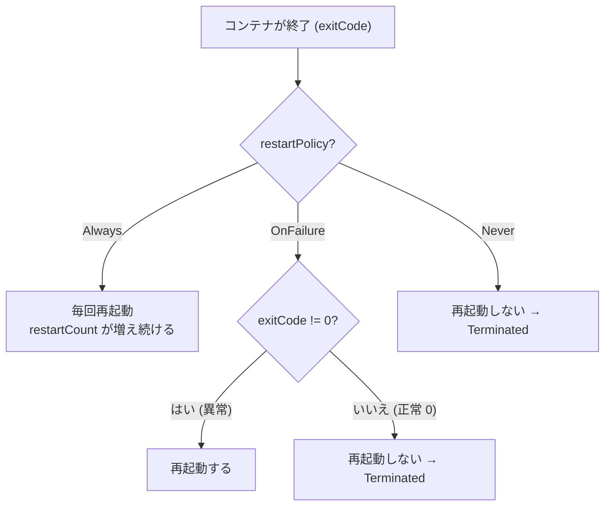
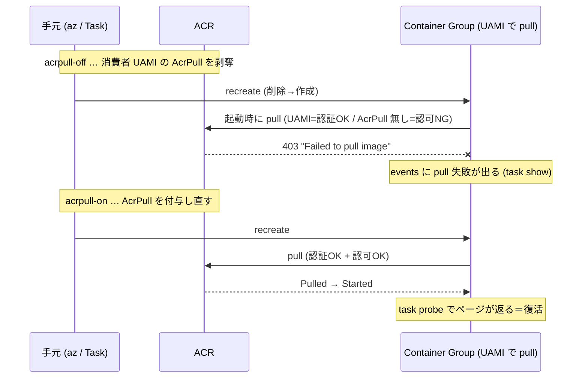
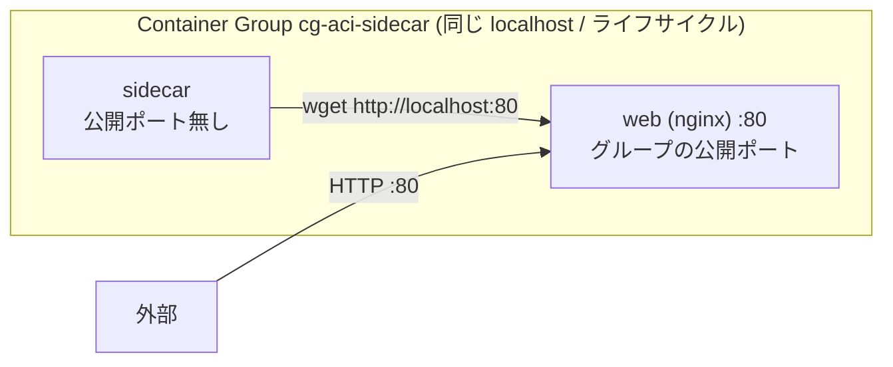

# MERMAID — `aci` の構成と実験

## 構成図（registry の出力を参照して keyless pull）

## 実験1: restartPolicy で再起動の有無が変わる（`task restart-demo`）

## 実験2: AcrPull を外すと keyless pull が 403（`task acrpull-off → recreate → show`）

UAMI 本人を主語にした 403 体感。Step 1 では SP で代役した宿題をここで回収する。

> 認証（UAMI という誰か）は変えず・**認可（AcrPull の有無）だけ**で可否が変わる＝認証と認可は別物。

## 実験3: コンテナグループ（同居）は localhost を共有（`task sidecar`）

> sidecar は外に出ず localhost で隣の web に届く＝同居コンテナは network namespace を共有する（Pod 内マルチコンテナの最小形）。
