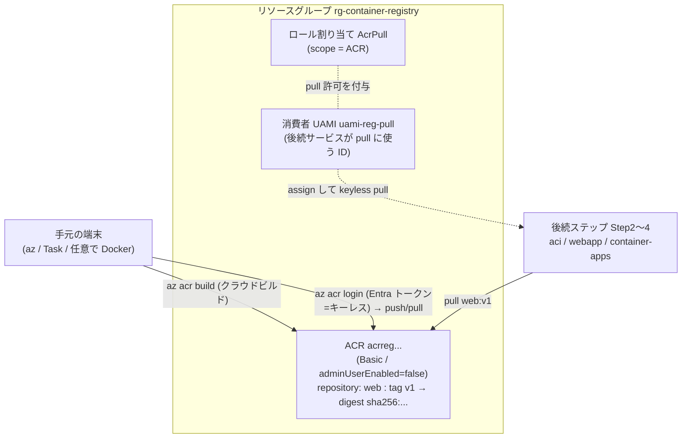
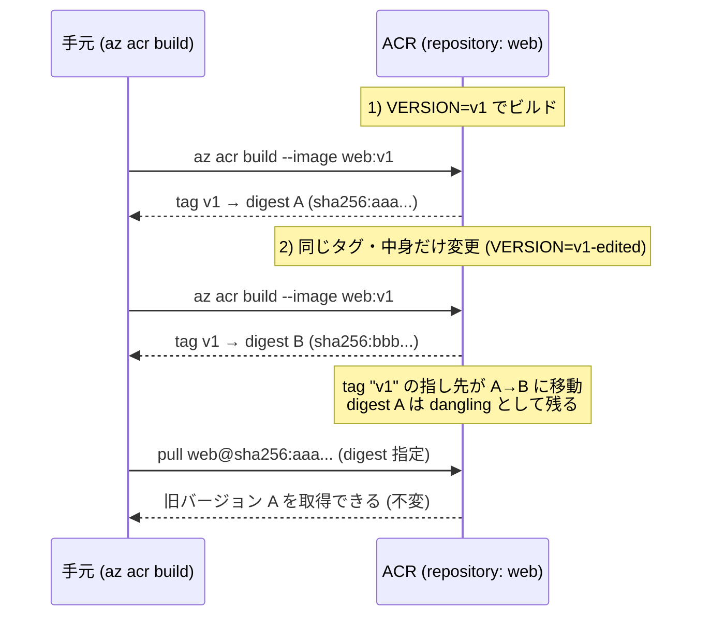
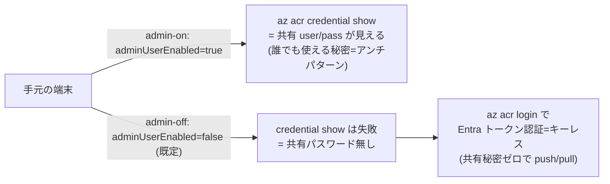
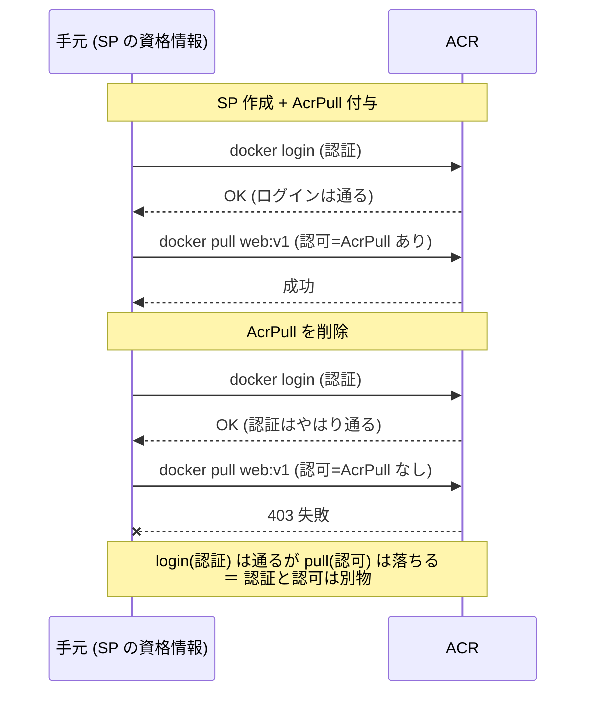

# MERMAID — `registry` の構成と実験

## 構成図（リソースの関係）

## 実験1: tag は動く参照 / digest は不変（`task digest-demo`）

## 実験2: admin user（共有パスワード）vs Entra トークン認証（`task admin-on` / `admin-off`）

## 実験3: 認証はそのまま・認可(AcrPull)で pull 可否が変わる（`task acrpull-setup`→`pull`→`revoke`→`pull`…）

UAMI（マネージド ID）は Azure リソースの中からしか使えない（IMDS 経由）ため、手元から成り代われない。
そこで **AcrPull だけ持つ SP を非特権 ID の代役**にして、ローカルから成功⇄403 を観測する。
ロールの出し入れ（`revoke`/`grant`）と pull（`acrpull-pull`）を分けてあり、**pull はロールを触らない**ので
反映待ちでも何度でも再実行して切り替わりを観察できる。

> 注: ここで触るのは SP の代役実験。ACR に作った**消費者 UAMI 本人**を主語にした「AcrPull を外すと pull 失敗」は、
> UAMI を assign できる計算リソースが要るので **Step 2 (`aci`)** で行う（Step 1 は AcrPull を付けた土台まで）。
