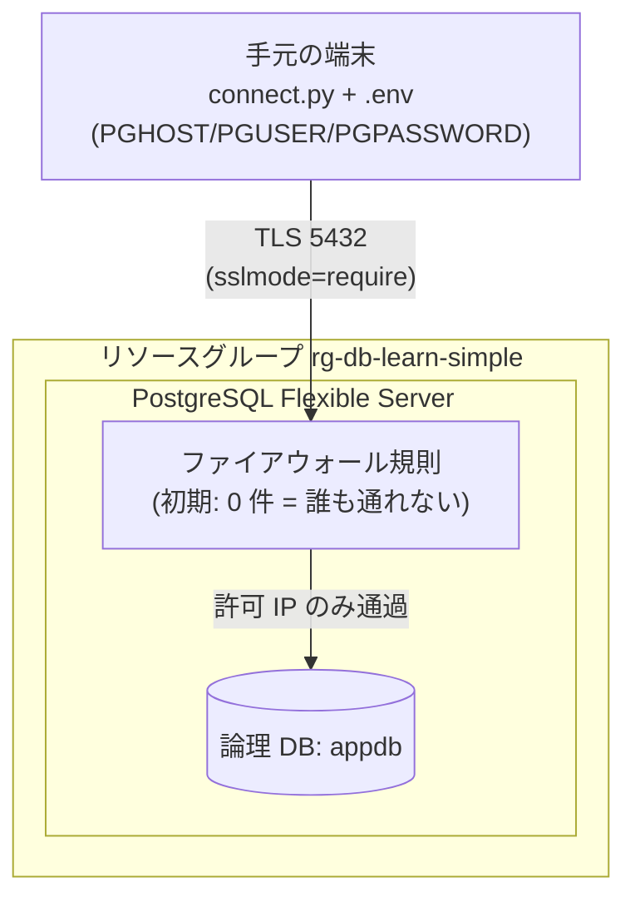
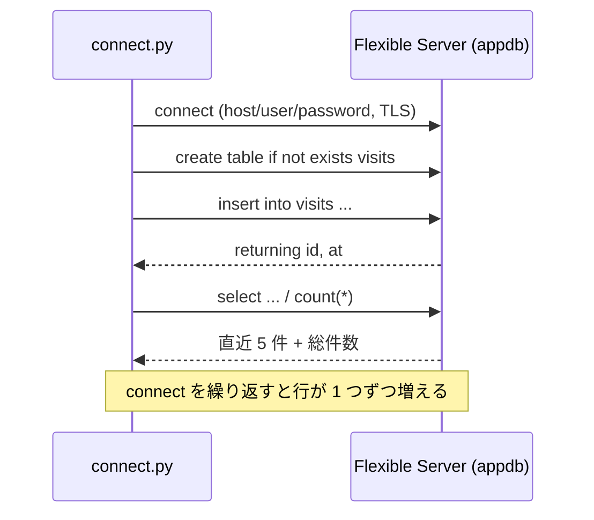
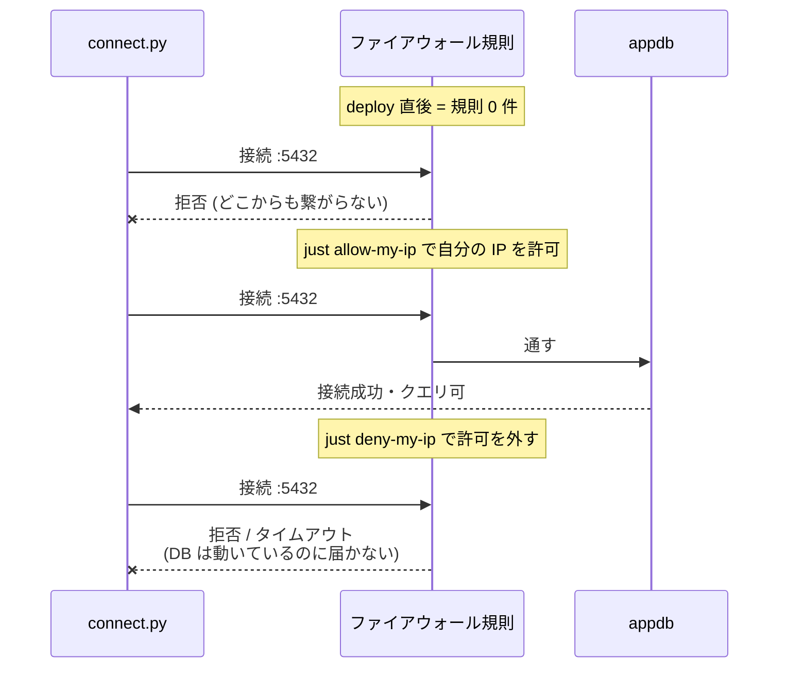

# MERMAID — `simple` の構成と実験

## 構成図（リソースの関係）

```mermaid
graph TD
    subgraph RG["リソースグループ rg-db-learn-simple"]
        subgraph PG["PostgreSQL Flexible Server<br/>pg-dbsimple-xxxx (B1ms / v16)"]
            FW["ファイアウォール規則<br/>(初期: 0 件 = 誰も通れない)"]
            DB[("論理 DB: appdb")]
        end
    end

    User["手元の端末<br/>connect.py + .env<br/>(PGHOST/PGUSER/PGPASSWORD)"]

    User -- "TLS 5432<br/>(sslmode=require)" --> FW
    FW -- "許可 IP のみ通過" --> DB
```

## 接続の最小ループ（just connect）

```mermaid
sequenceDiagram
    participant U as connect.py
    participant S as Flexible Server (appdb)

    U->>S: connect (host/user/password, TLS)
    U->>S: create table if not exists visits
    U->>S: insert into visits ...
    S-->>U: returning id, at
    U->>S: select ... / count(*)
    S-->>U: 直近 5 件 + 総件数
    Note over U,S: connect を繰り返すと行が 1 つずつ増える
```

## 実験: ファイアウォール許可で到達が変わる

```mermaid
sequenceDiagram
    participant U as connect.py
    participant F as ファイアウォール規則
    participant D as appdb

    Note over F: deploy 直後 = 規則 0 件
    U->>F: 接続 :5432
    F--xU: 拒否 (どこからも繋がらない)

    Note over F: just allow-my-ip で自分の IP を許可
    U->>F: 接続 :5432
    F->>D: 通す
    D-->>U: 接続成功・クエリ可

    Note over F: just deny-my-ip で許可を外す
    U->>F: 接続 :5432
    F--xU: 拒否 / タイムアウト<br/>(DB は動いているのに届かない)
```
