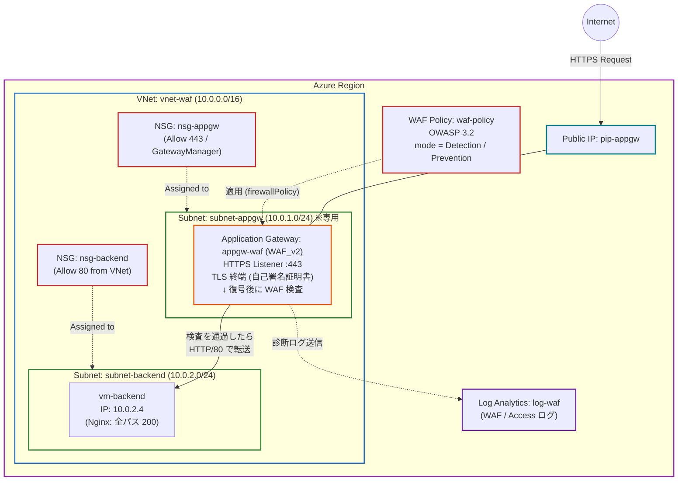
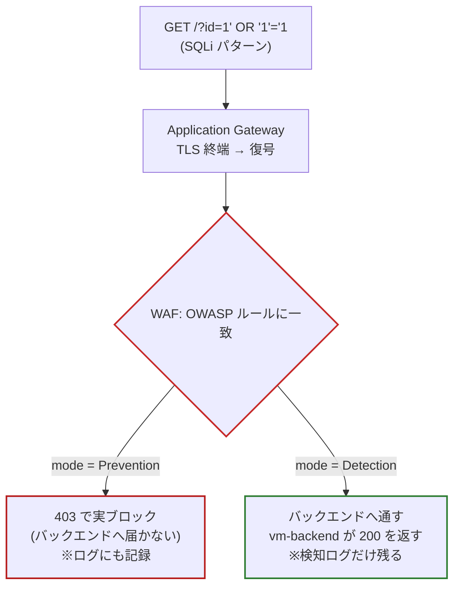
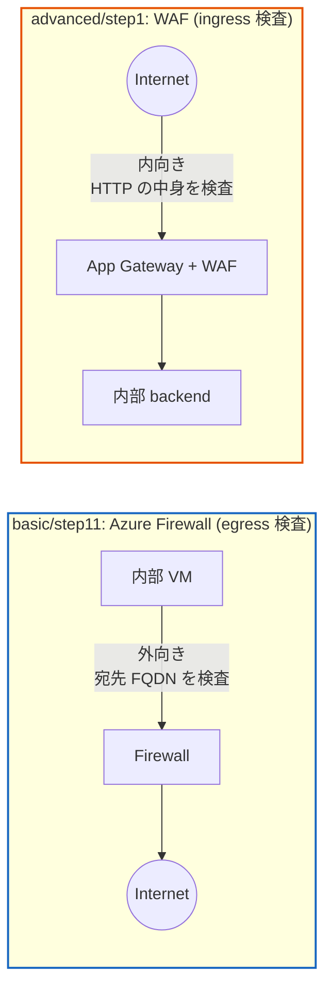

# advanced/step1: ネットワーク構成図

## 全体構成（TLS 終端 → WAF 検査 → バックエンド）

```mermaid
graph TD
    Internet((Internet))

    subgraph Azure["Azure Region"]
        PIP["Public IP: pip-appgw"]
        LAW["Log Analytics: log-waf<br/>(WAF / Access ログ)"]
        WAFP["WAF Policy: waf-policy<br/>OWASP 3.2<br/>mode = Detection / Prevention"]

        subgraph VNet["VNet: vnet-waf (10.0.0.0/16)"]

            subgraph SubnetAppgw["Subnet: subnet-appgw (10.0.1.0/24) ※専用"]
                APPGW["Application Gateway: appgw-waf (WAF_v2)<br/>HTTPS Listener :443<br/>TLS 終端 (自己署名証明書)<br/>↓ 復号後に WAF 検査"]
            end

            subgraph SubnetBackend["Subnet: subnet-backend (10.0.2.0/24)"]
                VM["vm-backend<br/>IP: 10.0.2.4<br/>(Nginx: 全パス 200)"]
            end

            NSGA["NSG: nsg-appgw<br/>(Allow 443 / GatewayManager)"]
            NSGB["NSG: nsg-backend<br/>(Allow 80 from VNet)"]
        end

        PIP --- APPGW
        WAFP -. "適用 (firewallPolicy)" .-> APPGW
        APPGW -- "検査を通過したら<br/>HTTP/80 で転送" --> VM
        APPGW -. "診断ログ送信" .-> LAW

        NSGA -. "Assigned to" .-> SubnetAppgw
        NSGB -. "Assigned to" .-> SubnetBackend
    end

    Internet -- "HTTPS Request" --> PIP

    style Azure stroke:#9c27b0,stroke-width:2px
    style VNet stroke:#1565c0,stroke-width:2px
    style SubnetAppgw stroke:#2e7d32,stroke-width:2px
    style SubnetBackend stroke:#2e7d32,stroke-width:2px
    style APPGW stroke:#e65100,stroke-width:2px
    style WAFP stroke:#c62828,stroke-width:2px
    style PIP stroke:#00838f,stroke-width:2px
    style LAW stroke:#6a1b9a,stroke-width:2px
    style NSGA stroke:#c62828,stroke-width:2px
    style NSGB stroke:#c62828,stroke-width:2px
```

## 悪性リクエスト時の分岐（mode の出し入れ）

同じ「`?id=1' OR '1'='1`」というリクエストでも、WAF の mode によって結末が変わる。

```mermaid
graph TD
    REQ["GET /?id=1' OR '1'='1<br/>(SQLi パターン)"]
    TLS["Application Gateway<br/>TLS 終端 → 復号"]
    WAF{"WAF: OWASP ルールに一致"}

    REQ --> TLS --> WAF

    WAF -->|"mode = Prevention"| BLOCK["403 で実ブロック<br/>(バックエンドへ届かない)<br/>※ログにも記録"]
    WAF -->|"mode = Detection"| PASS["バックエンドへ通す<br/>vm-backend が 200 を返す<br/>※検知ログだけ残る"]

    style WAF stroke:#c62828,stroke-width:2px
    style BLOCK stroke:#b71c1c,stroke-width:2px
    style PASS stroke:#2e7d32,stroke-width:2px
```

## 検査の向き（basic/step11 との対比）

```mermaid
graph LR
    subgraph EG["basic/step11: Azure Firewall (egress 検査)"]
        IN1["内部 VM"] -->|"外向き<br/>宛先 FQDN を検査"| FW["Firewall"] --> OUT1((Internet))
    end

    subgraph IG["advanced/step1: WAF (ingress 検査)"]
        OUT2((Internet)) -->|"内向き<br/>HTTP の中身を検査"| AG["App Gateway + WAF"] --> IN2["内部 backend"]
    end

    style EG stroke:#1565c0,stroke-width:2px
    style IG stroke:#e65100,stroke-width:2px
```
