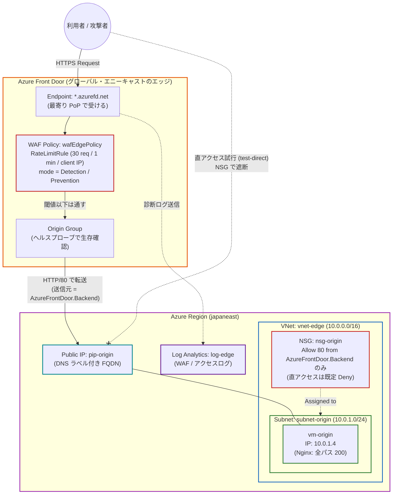
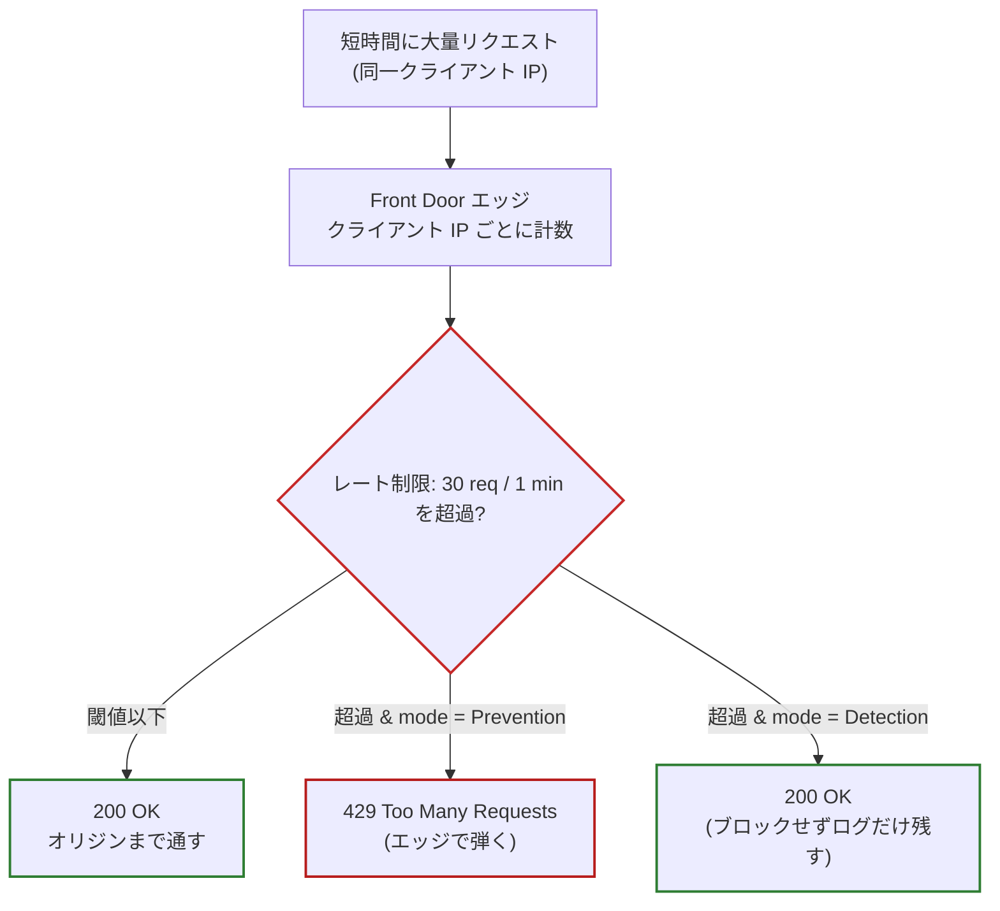
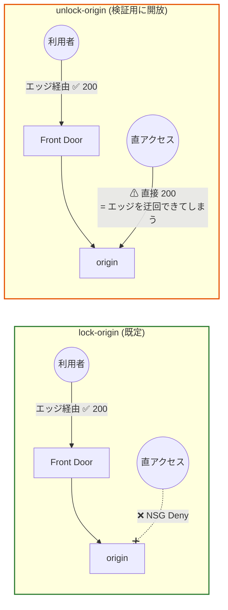
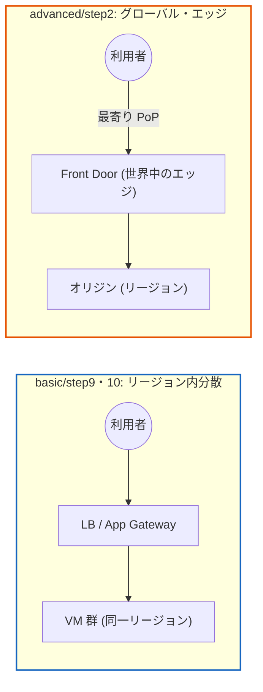

# advanced/step2: ネットワーク構成図

## 全体構成（エッジで受ける → オリジンへ転送）

## 体積型攻撃の緩和（flood × mode の出し入れ）

短時間に大量のリクエストを送ったとき、WAF の mode によって結末が変わる。

## エッジ経由の強制（オリジンの lock / unlock）

オリジンへ「必ずエッジを通させる」のが NSG の service tag。出し入れで因果を確かめる。

## グローバル vs リージョン内（basic との対比）

