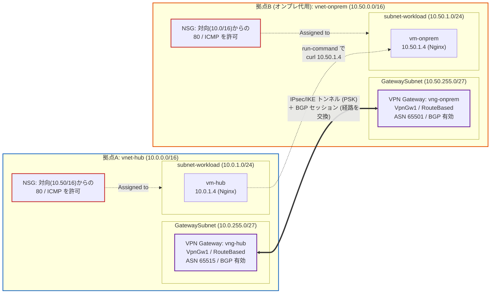
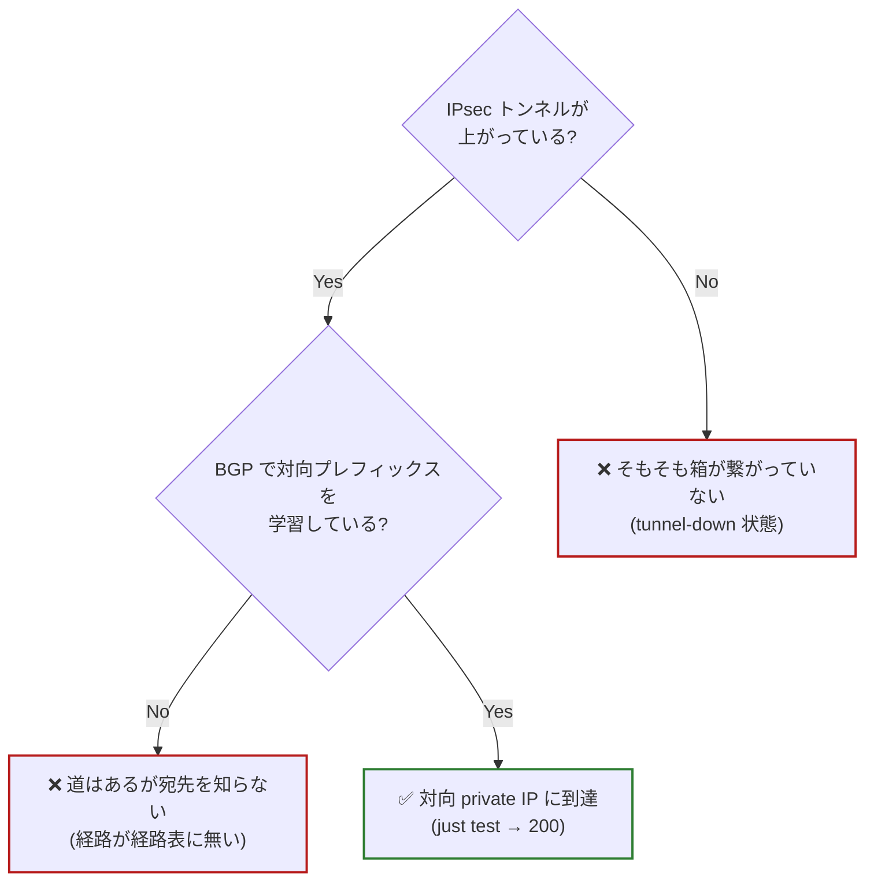
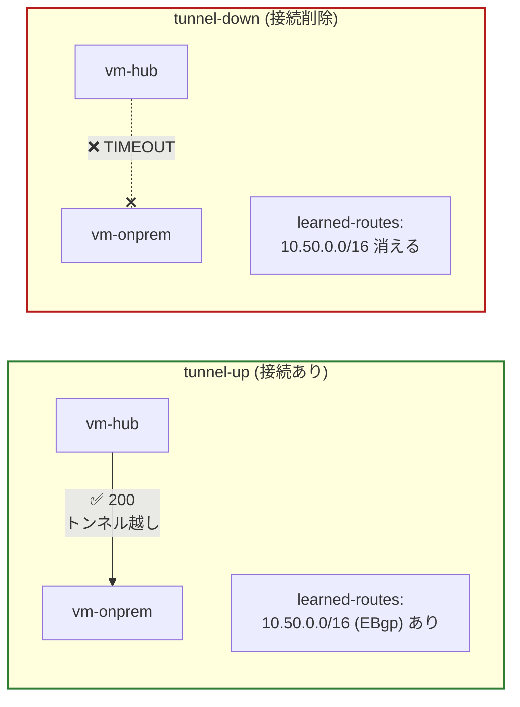
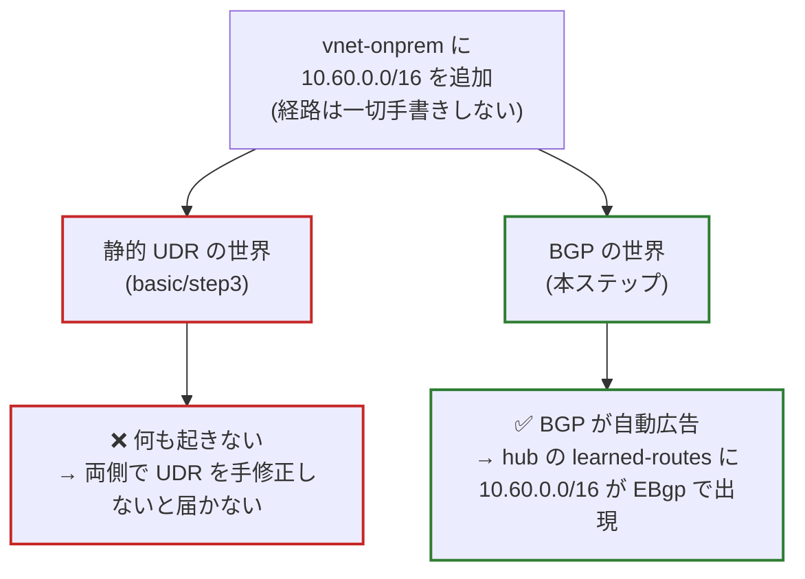

# advanced/step3: ネットワーク構成図

## 全体構成（2 拠点を IPsec トンネル＋BGP で結ぶ）

```mermaid
graph LR
    subgraph Hub["拠点A: vnet-hub (10.0.0.0/16)"]
        subgraph HGW["GatewaySubnet (10.0.255.0/27)"]
            VNGH["VPN Gateway: vng-hub<br/>VpnGw1 / RouteBased<br/>ASN 65515 / BGP 有効"]
        end
        subgraph HWL["subnet-workload (10.0.1.0/24)"]
            VMH["vm-hub<br/>10.0.1.4 (Nginx)"]
        end
        NSGH["NSG: 対向(10.50/16)からの<br/>80 / ICMP を許可"]
    end

    subgraph Onprem["拠点B (オンプレ代用): vnet-onprem (10.50.0.0/16)"]
        subgraph OGW["GatewaySubnet (10.50.255.0/27)"]
            VNGO["VPN Gateway: vng-onprem<br/>VpnGw1 / RouteBased<br/>ASN 65501 / BGP 有効"]
        end
        subgraph OWL["subnet-workload (10.50.1.0/24)"]
            VMO["vm-onprem<br/>10.50.1.4 (Nginx)"]
        end
        NSGO["NSG: 対向(10.0/16)からの<br/>80 / ICMP を許可"]
    end

    VNGH <== "IPsec/IKE トンネル (PSK)<br/>＋ BGP セッション (経路を交換)" ==> VNGO

    VMH -. "run-command で<br/>curl 10.50.1.4" .-> VMO
    NSGH -. "Assigned to" .-> HWL
    NSGO -. "Assigned to" .-> OWL

    style Hub stroke:#1565c0,stroke-width:2px
    style Onprem stroke:#e65100,stroke-width:2px
    style VNGH stroke:#6a1b9a,stroke-width:2px
    style VNGO stroke:#6a1b9a,stroke-width:2px
    style NSGH stroke:#c62828,stroke-width:2px
    style NSGO stroke:#c62828,stroke-width:2px
```

## 関心の分離: トンネル（到達）と BGP（経路伝播）は別もの

```mermaid
graph TD
    Q1{"IPsec トンネルが<br/>上がっている?"}
    Q2{"BGP で対向プレフィックスを<br/>学習している?"}
    OK["✅ 対向 private IP に到達<br/>(just test → 200)"]
    NG1["❌ そもそも箱が繋がっていない<br/>(tunnel-down 状態)"]
    NG2["❌ 道はあるが宛先を知らない<br/>(経路が経路表に無い)"]

    Q1 -->|"No"| NG1
    Q1 -->|"Yes"| Q2
    Q2 -->|"No"| NG2
    Q2 -->|"Yes"| OK

    style OK stroke:#2e7d32,stroke-width:2px
    style NG1 stroke:#b71c1c,stroke-width:2px
    style NG2 stroke:#b71c1c,stroke-width:2px
```

## 出し入れ①: トンネル up / down（経路が消える／復活する）

```mermaid
graph LR
    subgraph UP["tunnel-up (接続あり)"]
        H1["vm-hub"] -->|"✅ 200<br/>トンネル越し"| O1["vm-onprem"]
        LR1["learned-routes:<br/>10.50.0.0/16 (EBgp) あり"]
    end

    subgraph DOWN["tunnel-down (接続削除)"]
        H2["vm-hub"] -. "❌ TIMEOUT" .-x O2["vm-onprem"]
        LR2["learned-routes:<br/>10.50.0.0/16 消える"]
    end

    style UP stroke:#2e7d32,stroke-width:2px
    style DOWN stroke:#b71c1c,stroke-width:2px
```

## 出し入れ②: BGP の真価 — 静的 UDR vs 動的伝播

```mermaid
graph TD
    ADD["vnet-onprem に<br/>10.60.0.0/16 を追加<br/>(経路は一切手書きしない)"]

    ADD --> S["静的 UDR の世界<br/>(basic/step3)"]
    ADD --> B["BGP の世界<br/>(本ステップ)"]

    S --> SR["❌ 何も起きない<br/>→ 両側で UDR を手修正しないと届かない"]
    B --> BR["✅ BGP が自動広告<br/>→ hub の learned-routes に<br/>10.60.0.0/16 が EBgp で出現"]

    style B stroke:#2e7d32,stroke-width:2px
    style BR stroke:#2e7d32,stroke-width:2px
    style S stroke:#c62828,stroke-width:2px
    style SR stroke:#c62828,stroke-width:2px
```
