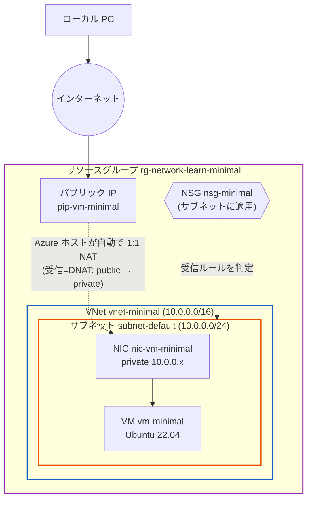
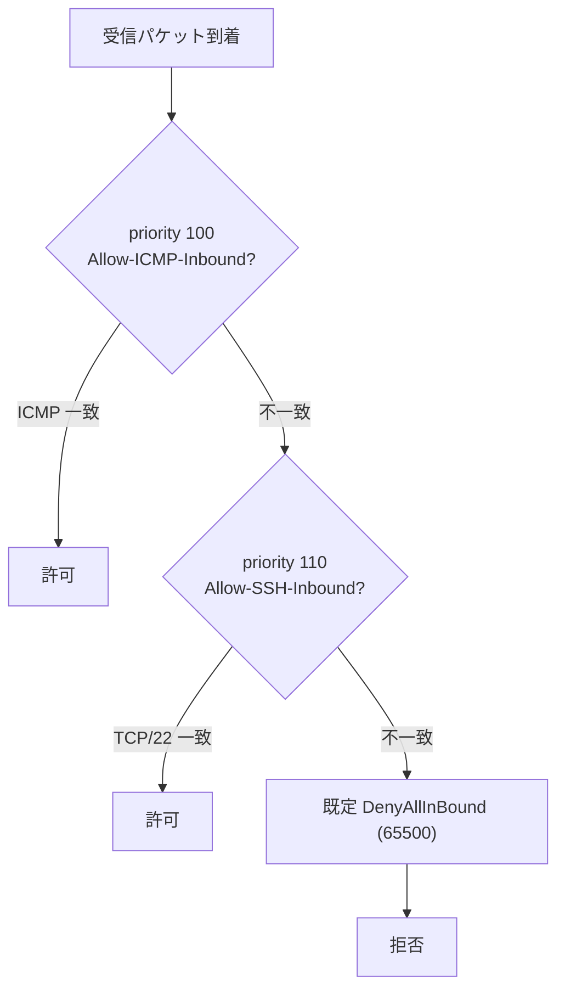
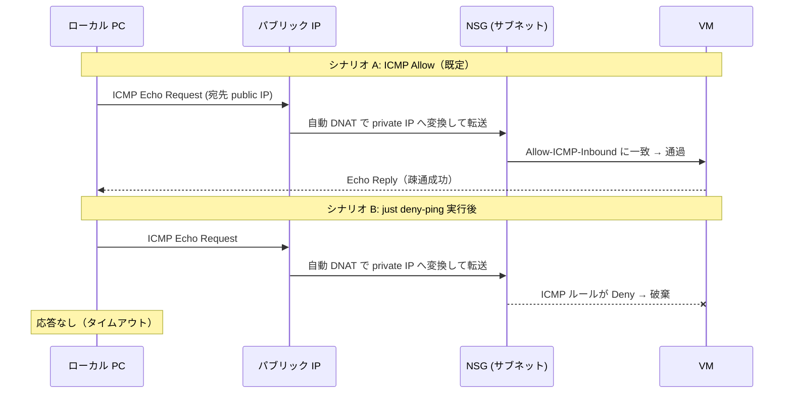

# Step 1 構成図（Mermaid）

このステップのネットワーク構成と、通信シナリオを Mermaid で表現します。

## 1. リソース構成図

VM はネットワークに直接つながらず、NIC を介してサブネットに所属します。
NSG は**サブネット**に適用され、受信通信を判定します。

> パブリック IP は独立した箱ではなく **NIC に紐づく属性**。NIC は「外向きの顔（public IP）」と「内向きの顔（private IP）」を 1 枚で持つ。

### NAT（アドレス変換）について — 誤解しないための補足

* **NAT とは**: パケットが通過する途中で **IP アドレスを書き換える**仕組み。
  * **DNAT**（宛先変換）: 受信時に「宛先＝パブリック IP」を「プライベート IP」へ書き換える。
  * **SNAT**（送信元変換）: 送信時に「送信元＝プライベート IP」を「パブリック IP」へ書き換える。
* **この変換は自動**: パブリック IP を NIC に関連付けるだけで、Azure が受信(DNAT)・送信(SNAT)の **1:1 NAT を自動で行う**。NAT ルールを自分で書く必要はない。
  * トリガーは `main.bicep` の NIC 設定 `ipConfigurations[].properties.publicIPAddress` への関連付けだけ。
* **変換するのは VM ではなく Azure ホスト側**: 実際の書き換えは VM の外（物理ホスト上の仮想スイッチ / SDN レイヤ）で行われる。
  * そのため **VM の OS はパブリック IP を一切知らない**。VM 内で `ip addr` を見てもプライベート IP しか出てこない。
* **「DNAT を設定する」別ケースとの違い**: Load Balancer のインバウンド NAT 規則、Azure Firewall / NVA の DNAT、NAT Gateway などは**ルールを明示的に定義**する。今回（NIC に直接パブリック IP）は、それらと違って**設定不要の自動 NAT**である点に注意。

## 2. NSG の受信ルール評価（priority 順）

> priority の小さいルールから評価され、最初に一致したルールで決まる。明示的に Allow しない通信は最後の `DenyAllInBound` で拒否される。

## 3. シナリオ: ping の許可 / 拒否

`just deny-ping` で ICMP ルールを Deny にすると、サブネット境界の NSG でパケットが破棄される（VM/OS は無変更）。

