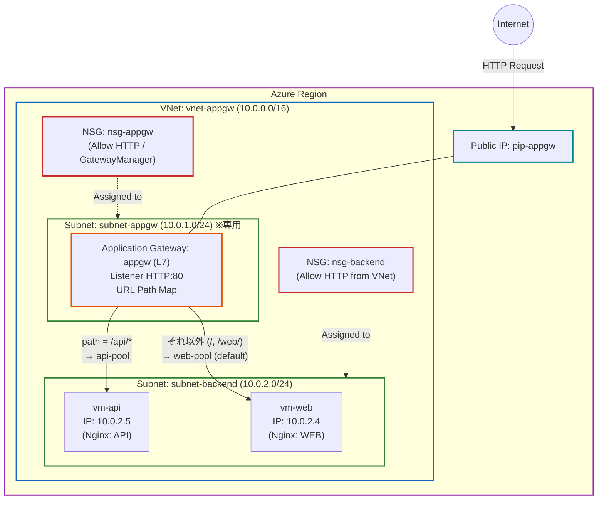
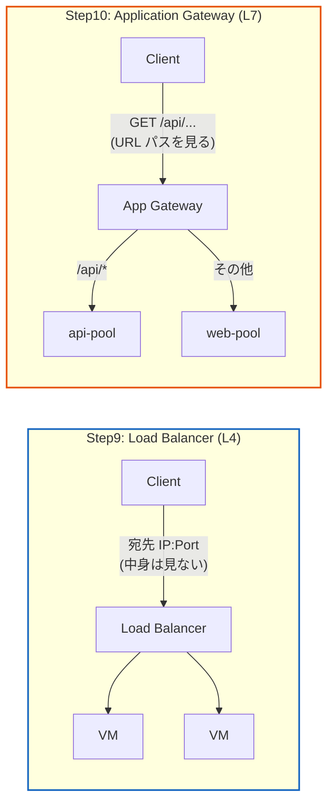

# Step10: ネットワーク構成図

## 全体構成とパスベースルーティング

```mermaid
graph TD
    %% 外部ネットワーク
    Internet((Internet))

    subgraph Azure["Azure Region"]
        PIP["Public IP: pip-appgw"]

        subgraph VNet["VNet: vnet-appgw (10.0.0.0/16)"]

            subgraph SubnetAppgw["Subnet: subnet-appgw (10.0.1.0/24) ※専用"]
                APPGW["Application Gateway: appgw (L7)<br/>Listener HTTP:80<br/>URL Path Map"]
            end

            subgraph SubnetBackend["Subnet: subnet-backend (10.0.2.0/24)"]
                VMWEB["vm-web<br/>IP: 10.0.2.4<br/>(Nginx: WEB)"]
                VMAPI["vm-api<br/>IP: 10.0.2.5<br/>(Nginx: API)"]
            end

            NSGA["NSG: nsg-appgw<br/>(Allow HTTP / GatewayManager)"]
            NSGB["NSG: nsg-backend<br/>(Allow HTTP from VNet)"]
        end

        %% ルーティング
        PIP --- APPGW
        APPGW -- "path = /api/*<br/>→ api-pool" --> VMAPI
        APPGW -- "それ以外 (/, /web/)<br/>→ web-pool (default)" --> VMWEB

        %% NSG 適用位置
        NSGA -. "Assigned to" .-> SubnetAppgw
        NSGB -. "Assigned to" .-> SubnetBackend
    end

    Internet -- "HTTP Request" --> PIP

    style Azure stroke:#9c27b0,stroke-width:2px
    style VNet stroke:#1565c0,stroke-width:2px
    style SubnetAppgw stroke:#2e7d32,stroke-width:2px
    style SubnetBackend stroke:#2e7d32,stroke-width:2px
    style APPGW stroke:#e65100,stroke-width:2px
    style PIP stroke:#00838f,stroke-width:2px
    style NSGA stroke:#c62828,stroke-width:2px
    style NSGB stroke:#c62828,stroke-width:2px
```

## L4 (Step9) と L7 (Step10) の振り分け判断の違い

```mermaid
graph LR
    subgraph L4["Step9: Load Balancer (L4)"]
        C1["Client"] -->|"宛先 IP:Port<br/>(中身は見ない)"| LB["Load Balancer"]
        LB --> B1["VM"]
        LB --> B2["VM"]
    end

    subgraph L7["Step10: Application Gateway (L7)"]
        C2["Client"] -->|"GET /api/...<br/>(URL パスを見る)"| AG["App Gateway"]
        AG -->|"/api/*"| API["api-pool"]
        AG -->|"その他"| WEB["web-pool"]
    end

    style L4 stroke:#1565c0,stroke-width:2px
    style L7 stroke:#e65100,stroke-width:2px
```
