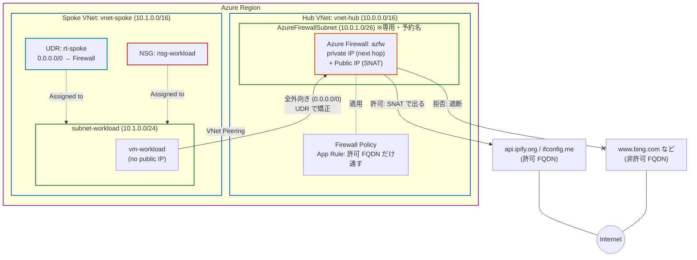
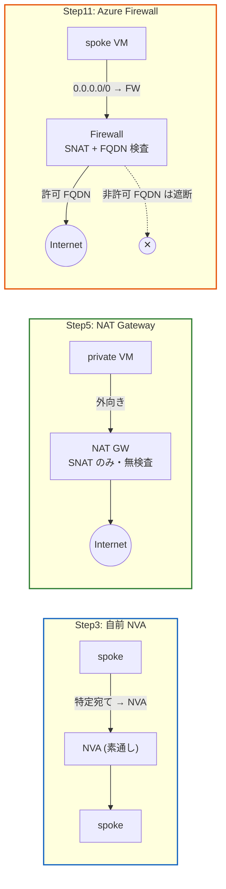

# Step11: ネットワーク構成図

## 全体構成と egress の中央集約・FQDN 検査

```mermaid
graph TD
    Internet((Internet))
    Allowed["api.ipify.org / ifconfig.me<br/>(許可 FQDN)"]
    Blocked["www.bing.com など<br/>(非許可 FQDN)"]

    subgraph Azure["Azure Region"]

        subgraph Hub["Hub VNet: vnet-hub (10.0.0.0/16)"]
            subgraph FWSubnet["AzureFirewallSubnet (10.0.1.0/26) ※専用・予約名"]
                AZFW["Azure Firewall: azfw<br/>private IP (next hop)<br/>+ Public IP (SNAT)"]
            end
            POLICY["Firewall Policy<br/>App Rule: 許可 FQDN だけ通す"]
        end

        subgraph Spoke["Spoke VNet: vnet-spoke (10.1.0.0/16)"]
            subgraph WLSubnet["subnet-workload (10.1.0.0/24)"]
                VMWL["vm-workload<br/>(no public IP)"]
            end
            RT["UDR: rt-spoke<br/>0.0.0.0/0 → Firewall"]
            NSGW["NSG: nsg-workload"]
        end

        AZFW -. "適用" .- POLICY
        RT -. "Assigned to" .-> WLSubnet
        NSGW -. "Assigned to" .-> WLSubnet
    end

    %% Peering
    Hub <-- "VNet Peering" --> Spoke

    %% egress flow
    VMWL -- "全外向き (0.0.0.0/0)<br/>UDR で矯正" --> AZFW
    AZFW -- "許可: SNAT で出る" --> Allowed
    AZFW -- "拒否: 遮断" --x Blocked
    Allowed --- Internet
    Blocked --- Internet

    style Azure stroke:#9c27b0,stroke-width:2px
    style Hub stroke:#1565c0,stroke-width:2px
    style Spoke stroke:#1565c0,stroke-width:2px
    style FWSubnet stroke:#2e7d32,stroke-width:2px
    style WLSubnet stroke:#2e7d32,stroke-width:2px
    style AZFW stroke:#e65100,stroke-width:2px
    style RT stroke:#00838f,stroke-width:2px
    style NSGW stroke:#c62828,stroke-width:2px
```

## 「集約だけ」と「集約＋検査」の違い（Step5 / Step3 との対比）

```mermaid
graph LR
    subgraph S3["Step3: 自前 NVA"]
        A1["spoke"] -->|"特定宛て → NVA"| N1["NVA (素通し)"]
        N1 --> A2["spoke"]
    end

    subgraph S5["Step5: NAT Gateway"]
        B1["private VM"] -->|"外向き"| NG["NAT GW<br/>SNAT のみ・無検査"]
        NG --> NET1((Internet))
    end

    subgraph S11["Step11: Azure Firewall"]
        C1["spoke VM"] -->|"0.0.0.0/0 → FW"| FW["Firewall<br/>SNAT + FQDN 検査"]
        FW -->|"許可 FQDN"| NET2((Internet))
        FW -.->|"非許可 FQDN は遮断"| X((✕))
    end

    style S3 stroke:#1565c0,stroke-width:2px
    style S5 stroke:#2e7d32,stroke-width:2px
    style S11 stroke:#e65100,stroke-width:2px
```
