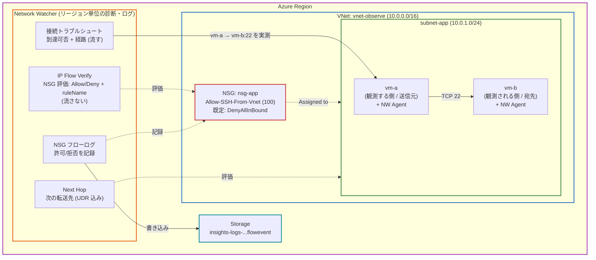
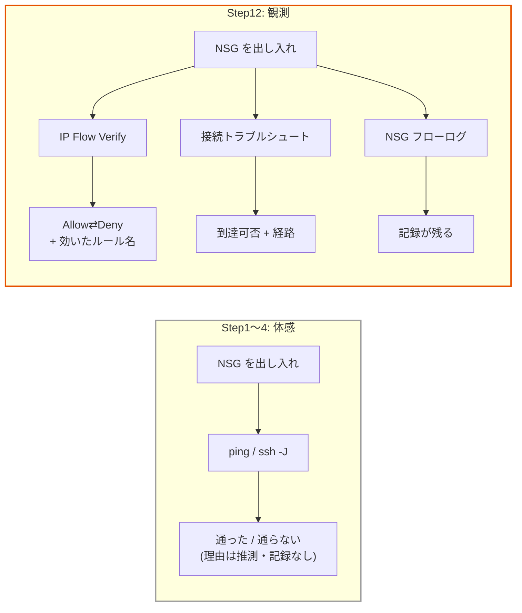
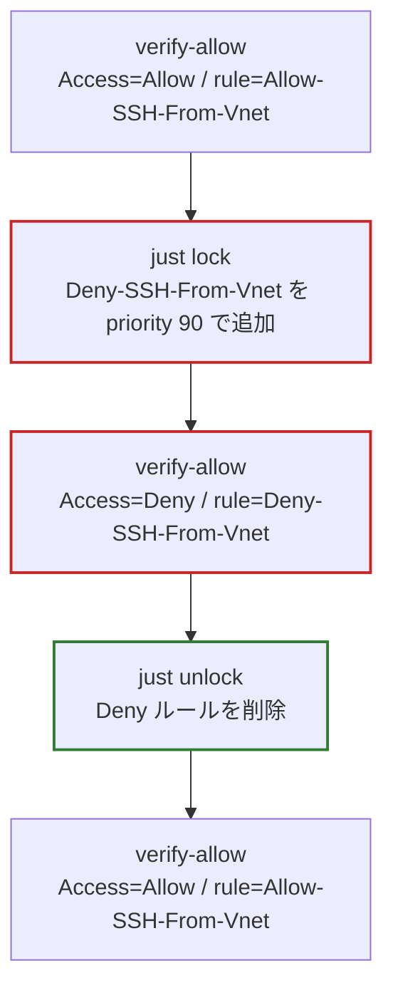

# Step12: ネットワーク構成図

## 観測対象の最小環境と、4 つの観測ツールの当てどころ

```mermaid
graph TD
    subgraph Azure["Azure Region"]

        subgraph NW["Network Watcher (リージョン単位の診断・ログ)"]
            IPFV["IP Flow Verify<br/>NSG 評価: Allow/Deny + ruleName<br/>(流さない)"]
            CONN["接続トラブルシュート<br/>到達可否 + 経路 (流す)"]
            NH["Next Hop<br/>次の転送先 (UDR 込み)"]
            FL["NSG フローログ<br/>許可/拒否を記録"]
        end

        subgraph VNet["VNet: vnet-observe (10.0.0.0/16)"]
            subgraph Sub["subnet-app (10.0.1.0/24)"]
                VMA["vm-a<br/>(観測する側 / 送信元)<br/>+ NW Agent"]
                VMB["vm-b<br/>(観測される側 / 宛先)<br/>+ NW Agent"]
            end
            NSG["NSG: nsg-app<br/>Allow-SSH-From-Vnet (100)<br/>既定: DenyAllInBound"]
        end

        ST["Storage<br/>insights-logs-...flowevent"]

        NSG -. "Assigned to" .-> Sub
        IPFV -. "評価" .-> NSG
        NH -. "評価" .-> Sub
        CONN -- "vm-a → vm-b:22 を実測" --> VMA
        VMA -- "TCP 22" --> VMB
        FL -. "記録" .-> NSG
        FL -- "書き込み" --> ST
    end

    style Azure stroke:#9c27b0,stroke-width:2px
    style NW stroke:#e65100,stroke-width:2px
    style VNet stroke:#1565c0,stroke-width:2px
    style Sub stroke:#2e7d32,stroke-width:2px
    style NSG stroke:#c62828,stroke-width:2px
    style ST stroke:#00838f,stroke-width:2px
```

## 「体感（これまで）」と「観測（本ステップ）」の対比

```mermaid
graph LR
    subgraph Before["Step1〜4: 体感"]
        B1["NSG を出し入れ"] --> B2["ping / ssh -J"]
        B2 --> B3["通った / 通らない<br/>(理由は推測・記録なし)"]
    end

    subgraph After["Step12: 観測"]
        A1["NSG を出し入れ"] --> A2["IP Flow Verify"]
        A2 --> A3["Allow⇄Deny<br/>+ 効いたルール名"]
        A1 --> A4["接続トラブルシュート"]
        A4 --> A5["到達可否 + 経路"]
        A1 --> A6["NSG フローログ"]
        A6 --> A7["記録が残る"]
    end

    style Before stroke:#9e9e9e,stroke-width:2px
    style After stroke:#e65100,stroke-width:2px
```

## lock/unlock で観測が因果を捉える（流さずに判定が変わる）

```mermaid
graph TD
    S0["verify-allow<br/>Access=Allow / rule=Allow-SSH-From-Vnet"]
    L["just lock<br/>Deny-SSH-From-Vnet を priority 90 で追加"]
    S1["verify-allow<br/>Access=Deny / rule=Deny-SSH-From-Vnet"]
    U["just unlock<br/>Deny ルールを削除"]
    S2["verify-allow<br/>Access=Allow / rule=Allow-SSH-From-Vnet"]

    S0 --> L --> S1 --> U --> S2

    style L stroke:#c62828,stroke-width:2px
    style U stroke:#2e7d32,stroke-width:2px
    style S1 stroke:#c62828,stroke-width:2px
```
