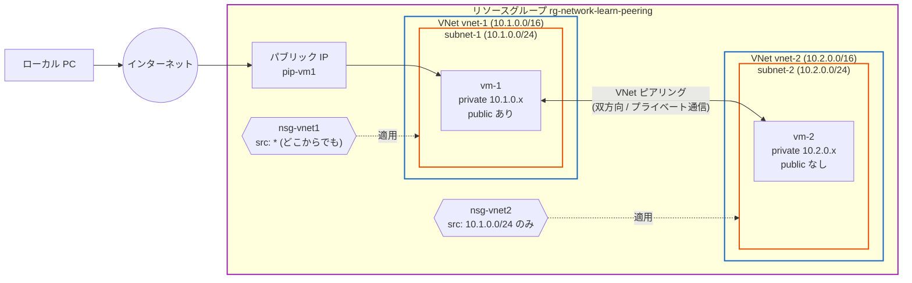
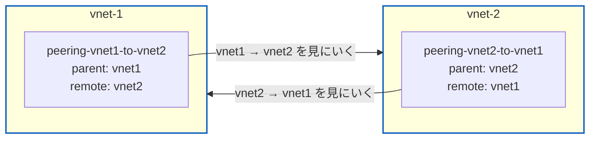
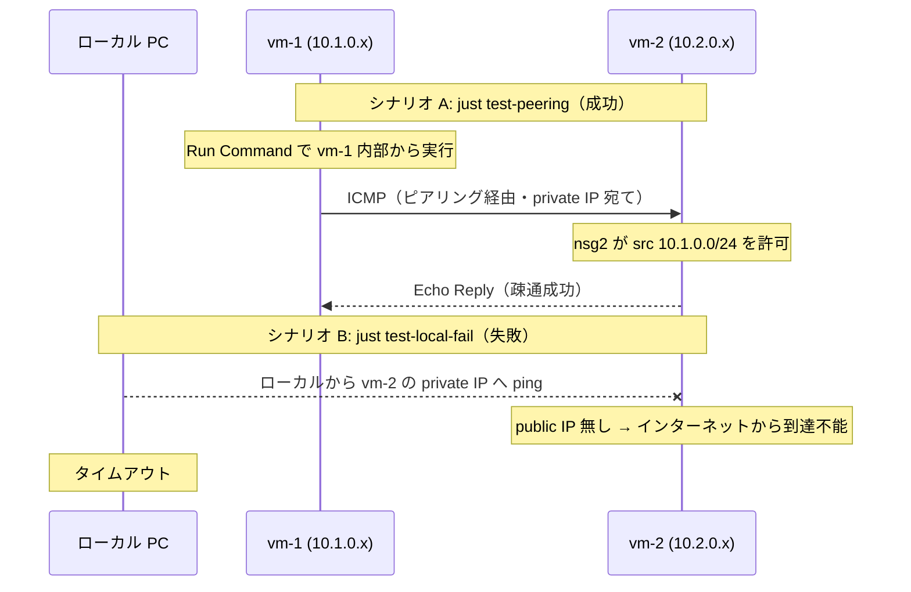

# Step 2 構成図（Mermaid）

VNet ピアリングで 2 つの独立した VNet を接続し、VM 同士がプライベート IP で通信する構成を表現します。

## 1. リソース構成図

vm-1 はパブリック IP あり（入口）、vm-2 はパブリック IP なし（隔離）。
2 つの VNet は双方向のピアリングで接続される。

## 2. ピアリングは双方向に 2 つ定義する

片方だけでは状態が `Initiated` のまま。両方そろって `Connected` になり通信が成立する。

> 両ピアリングとも `allowVirtualNetworkAccess=true` のみ有効化し、forwarded / gatewayTransit / useRemoteGateways は false（最小構成）。

## 3. シナリオ: 経路がプライベートであることの二重の担保

> A が成功し B が失敗することで、成功した通信が確実に **VNet ピアリング経由のプライベート通信**であることを担保する。さらに nsg2 で送信元を subnet-1 に限定し、NSG レベルでも裏付けている。
