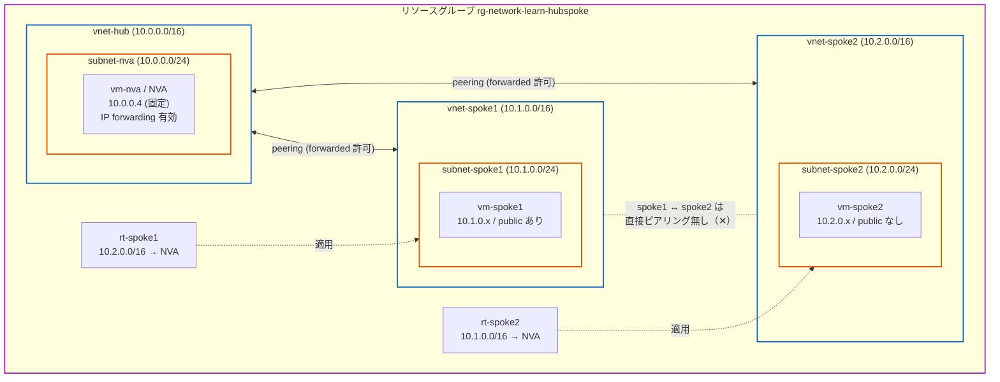
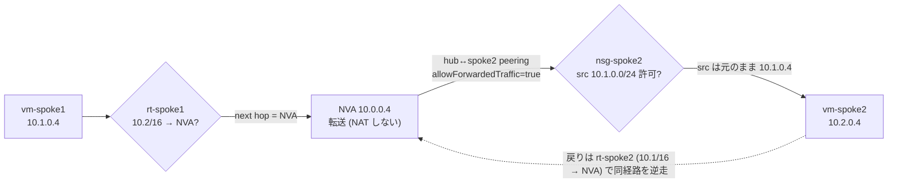
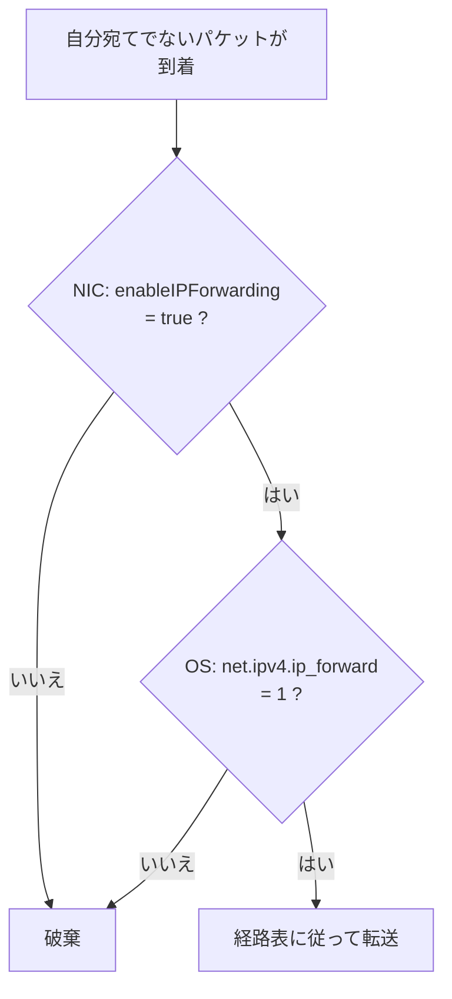
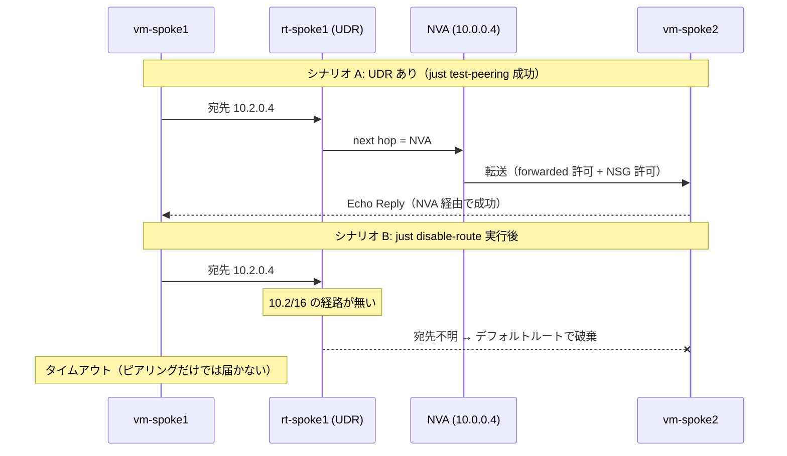

# Step 3 構成図（Mermaid）

Hub-Spoke 構成と UDR による spoke 間ルーティングを表現します。

## 1. リソース構成図

ハブに NVA（中継ルーター）を置き、各スポークはハブとだけピアリングする。
**spoke1 ↔ spoke2 は直接ピアリングしない**。各スポークの UDR が「相手 spoke 宛ては NVA 経由」と経路を上書きする。

## 2. spoke1 → spoke2 の通信経路（UDR + NVA 経由）

直接の経路は無いが、UDR が next hop を NVA に向けることで通信が成立する。

## 3. NVA が「ルーター化」する二段構え

NIC（Azure 層）と OS（カーネル層）の両方で転送を許可して初めて中継できる。

## 4. シナリオ: UDR の有無で通信が変わる

`just disable-route` / `enable-route` で、経路を成立させているのが**ピアリングではなく UDR**だと確認できる。

> `just trace-route`（tracepath）で経路上に NVA(10.0.0.4) が hop として現れることからも、直接ではなく NVA を経由していることが確認できる。
