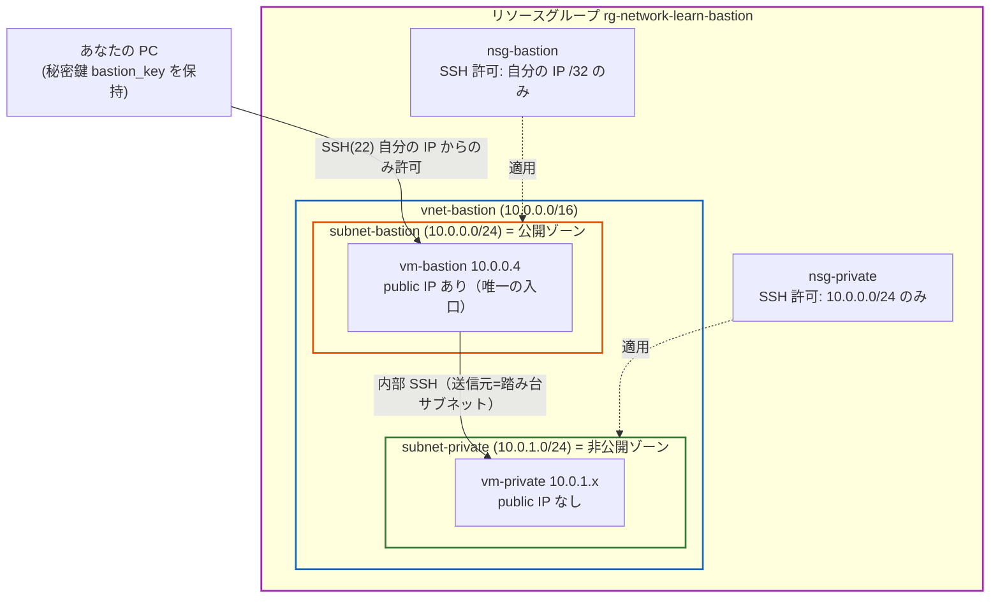
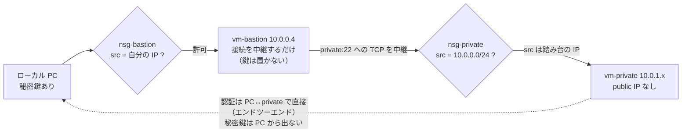
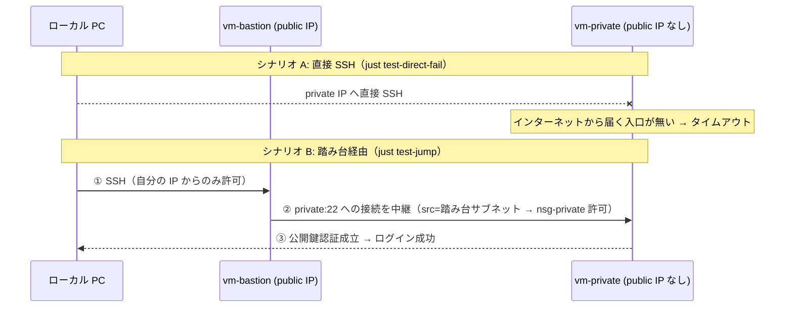
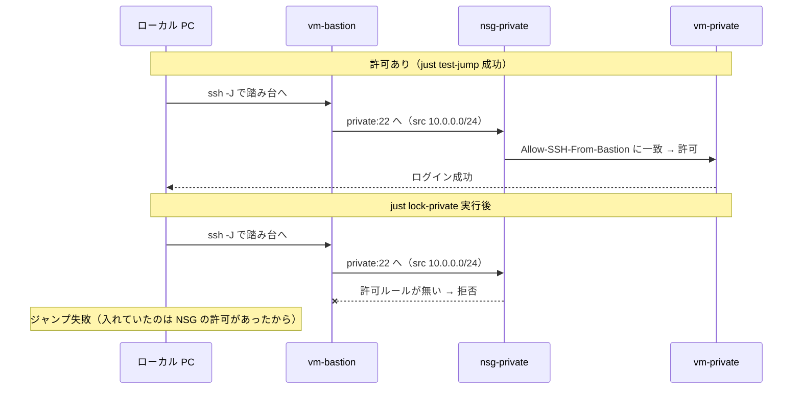
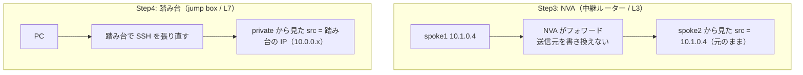

# Step 4 構成図（Mermaid）

踏み台（bastion）越しのプライベート VM アクセスを表現します。

## 1. リソース構成図

1 つの VNet を「公開ゾーン（踏み台）」と「非公開ゾーン（private VM）」の 2 サブネットに分ける。
インターネットに開くのは**踏み台だけ**で、しかも SSH 元は自分の IP に限定する。

## 2. 多段 SSH（ProxyJump）の流れ — 秘密鍵はローカルから出ない

`ssh -J azureuser@<踏み台> azureuser@<private>` の 1 コマンドで貫通する。
踏み台は「最終ホストへの TCP 接続を中継するだけ」で、SSH 認証は PC↔private で直接行う。

## 3. シナリオ: 直接は入れない / 踏み台経由なら入れる

private VM はパブリック IP を持たないため、ローカルから直接 SSH すると届かない。
踏み台を経由すると到達できる。

## 4. シナリオ: NSG の許可を出し入れすると通信が変わる

`just lock-private` / `unlock-private` で、private VM に入れていたのが
**nsg-private の踏み台サブネット許可**だと確認できる。

## 5. 踏み台（L7 で接続を張り直す）と NVA（L3 で素通し転送）の違い

Step3 の NVA はパケットを転送するだけ（NAT しない＝送信元は元のまま）。
踏み台は SSH 接続を張り直す（private から見た送信元は踏み台になる）。

