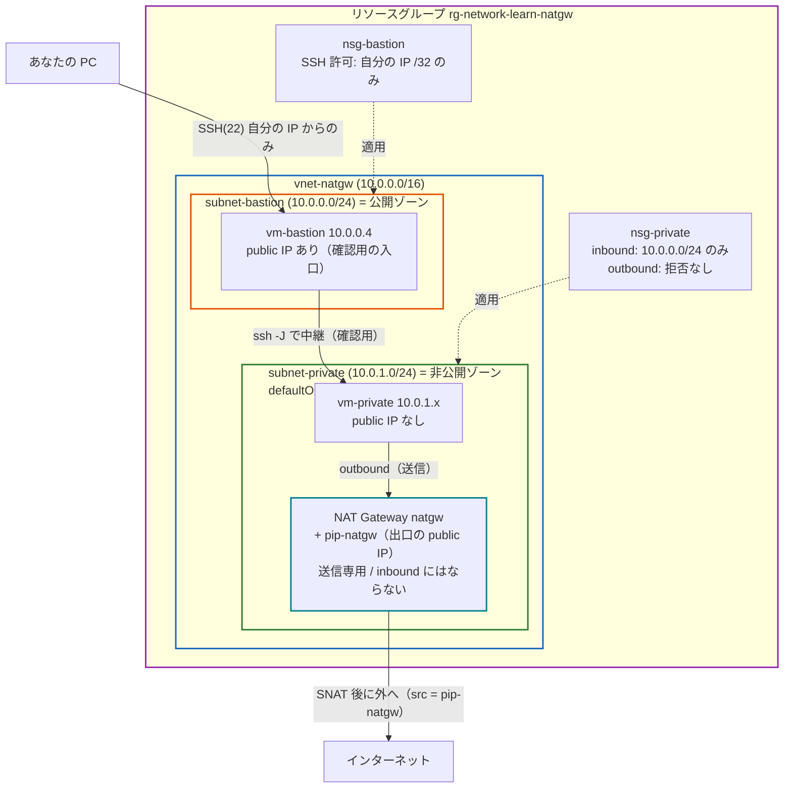
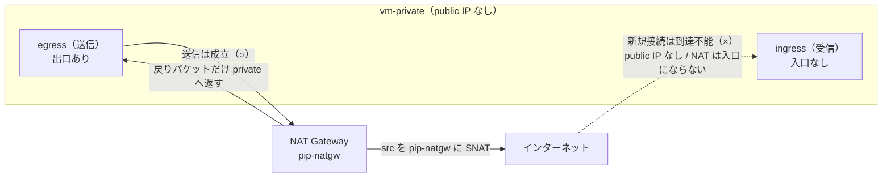
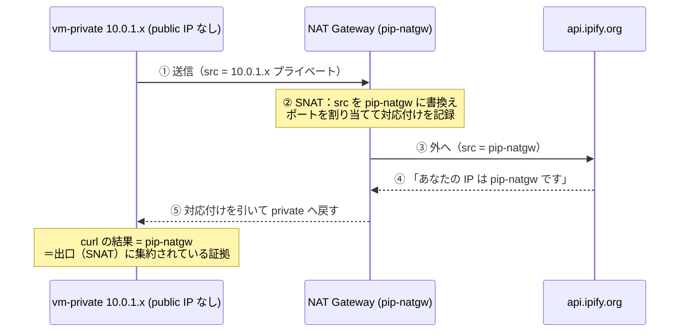
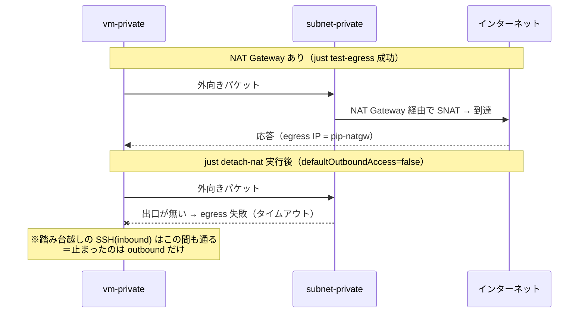
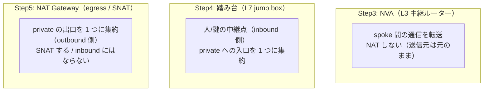

# Step 5 構成図（Mermaid）

パブリック IP を持たない private VM の **外向き通信（egress / SNAT）** を NAT Gateway で成立させる構成を表現します。

## 1. リソース構成図

private VM はパブリック IP を持たない（＝受信の入口が無い）が、サブネットに付けた **NAT Gateway** が
**送信専用の出口**になる。踏み台は確認のための入口で、主役は private VM の egress。

## 2. 「inbound を閉じる」と「outbound を許す」は別物

同じ private VM でも、受信（ingress）と送信（egress）は別レイヤ。
受信の入口は一切無いのに、送信の出口（NAT Gateway）は持てる、という非対称を 1 台で観察する。

## 3. SNAT の流れ — 外から見た送信元は「出口の IP」になる

`vm-private` が `https://api.ipify.org` に問い合わせると、返ってくる送信元 IP は
NAT Gateway のパブリック IP（`pip-natgw`）。`just test-egress` でこの一致を確認する。

## 4. シナリオ: NAT Gateway を出し入れすると outbound だけが変わる

`just detach-nat` / `attach-nat` で、外へ出られていたのが **NAT Gateway（出口）** だと確認する。
このとき **inbound（踏み台越し SSH）は終始変わらない**点が「inbound と outbound は別物」の証拠。

## 5. Step3 の NVA / Step4 の踏み台 / Step5 の NAT Gateway の違い

いずれも「内部ホストの通信を別の経路に通す」が、役割が異なる。

