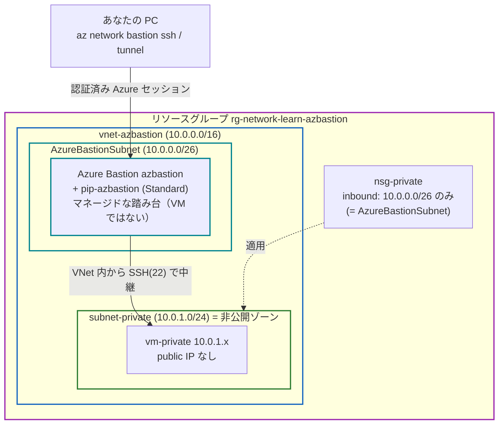
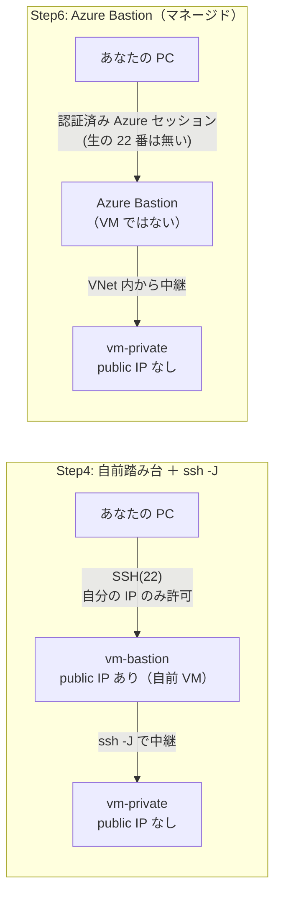
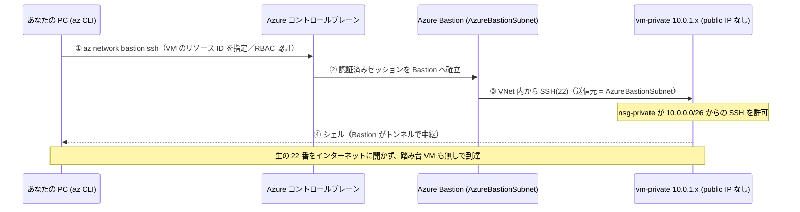
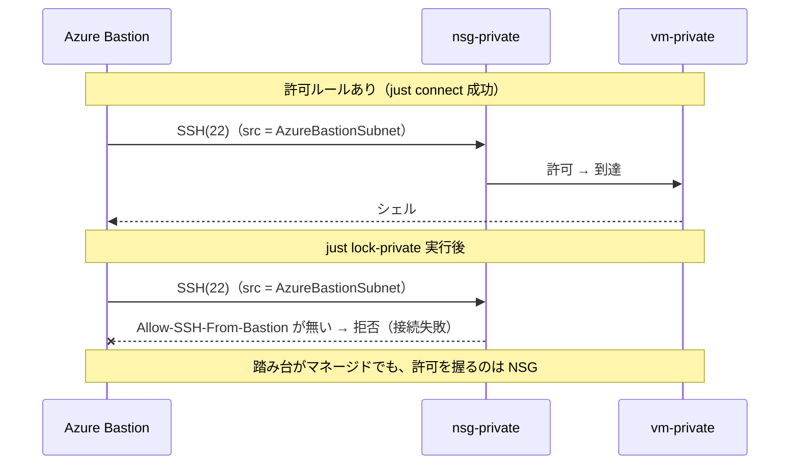
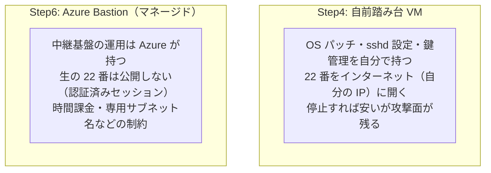

# Step 6 構成図（Mermaid）

自前の踏み台 VM（Step4）を、マネージドな **Azure Bastion** に置き換えて
パブリック IP を持たない private VM へ入る構成を表現します。

## 1. リソース構成図

踏み台 VM は存在せず、`AzureBastionSubnet` に置いた **Azure Bastion** が中継する。
利用者は生の SSH ポートではなく、Azure の認証済みセッション（CLI／ポータル）経由で到達する。

## 2. Step4（自前踏み台）→ Step6（Azure Bastion）の差分

ゴール（public IP の無い VM へ入る）は同じ。**踏み台の実体と到達方法**が変わる。

## 3. 接続シーケンス — Azure Bastion 越しの SSH

`az network bastion ssh`（または tunnel）は、接続先を **VM のリソース ID** で指定する。
Bastion が VNet 内から対象のプライベート IP:22 へ中継する。

## 4. シナリオ: NSG を出し入れすると Bastion 経由でも結果が変わる

`just lock-private` / `unlock-private` で、最終的に通しているのは
**private VM の NSG 許可（送信元 = AzureBastionSubnet）** だと確認する（Step4 と同じ手法）。

## 5. Step4 / Step6 の役割対比（踏み台の "誰が管理するか"）

