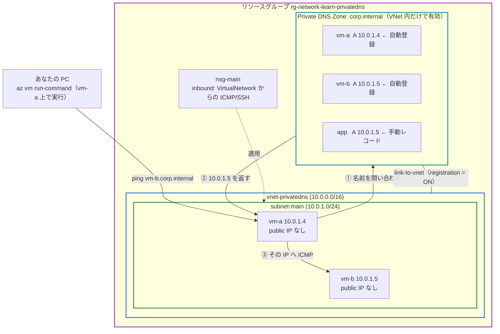
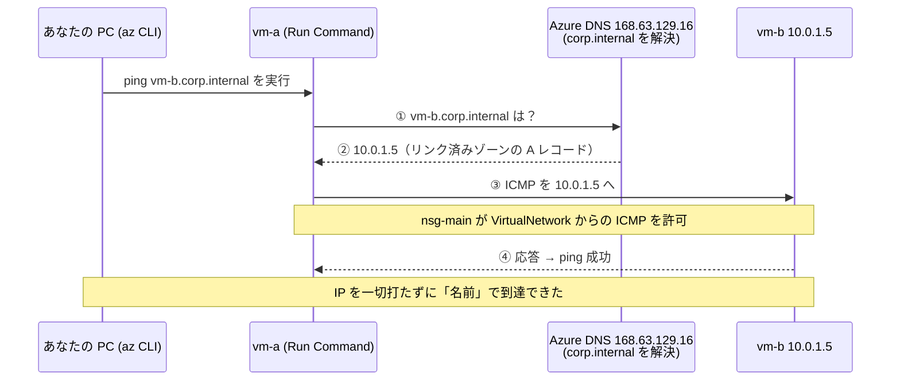
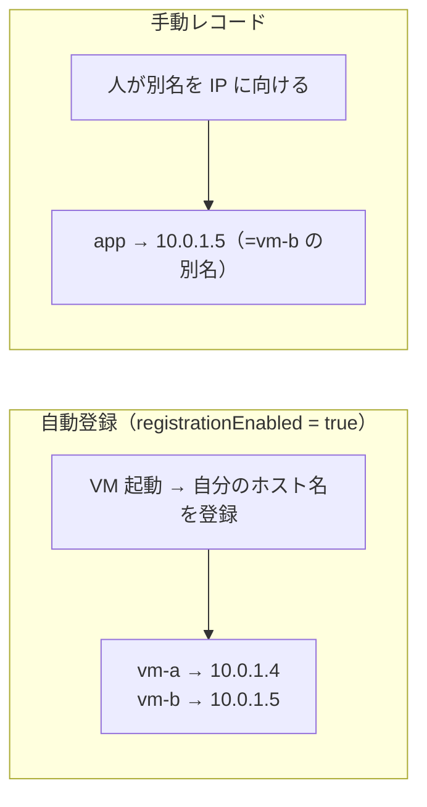
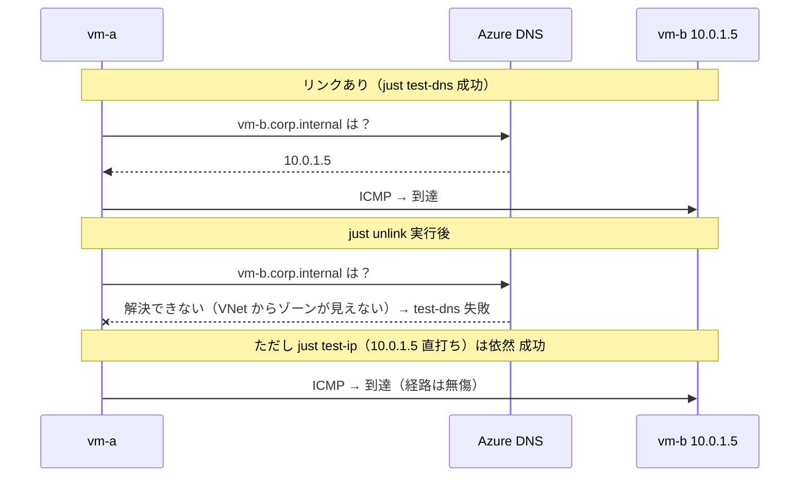

# Step 7 構成図（Mermaid）

IP 直打ち（Step1〜6）を、**Private DNS Zone による名前解決**に置き換える構成を表現します。

## 1. リソース構成図

VNet を Private DNS Zone `corp.internal` に**リンク**することで、VNet 内の VM が
名前（`vm-b.corp.internal` など）で互いに到達できる。`vm-a`/`vm-b` は自動登録、`app` は手動レコード。

## 2. 名前で到達するシーケンス（test-dns）

宛先を IP ではなく**名前**で指定する。VM はまず DNS に問い合わせ、返ってきた IP へ通信する。

## 3. 自動登録 と 手動レコード

同じゾーンに、機械的な実体名（自動登録）と人が決めた別名（手動）が併存する。

## 4. シナリオ: リンクを外すと「名前は引けないが IP では届く」

`just unlink` でリンクを削除すると名前解決だけが壊れる。経路（IP 到達性）は不変。
→ 名前で届いていたのは Private DNS Zone のおかげだと切り分けられる（NSG/UDR の出し入れと同じ手法）。

