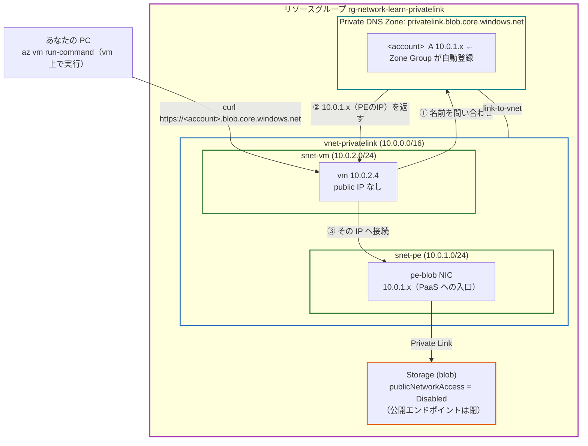
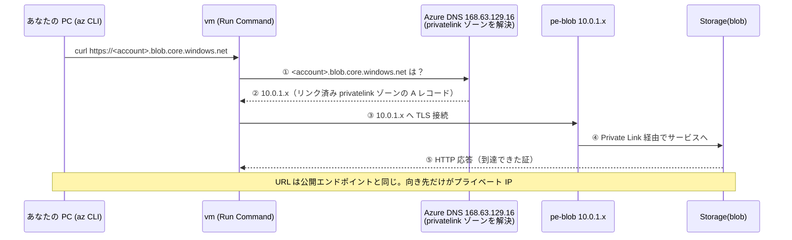
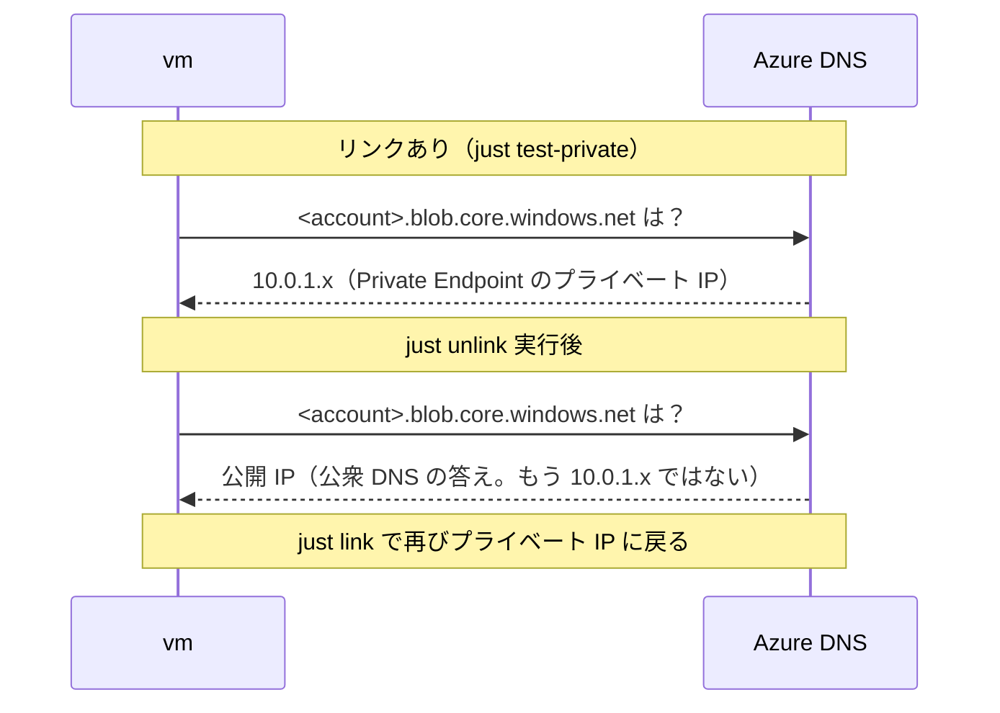
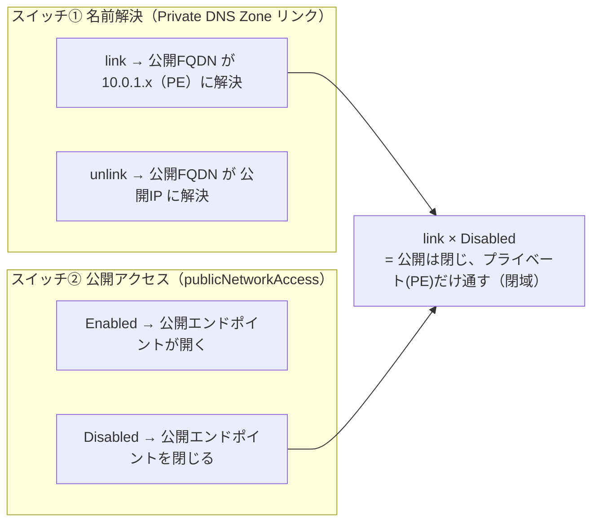

# Step 8 構成図（Mermaid）

PaaS（Storage/blob）へ、公衆インターネットを経由せず **VNet 内のプライベート IP** で到達する構成
（**Private Endpoint** + **Private DNS Zone**）を表現します。

## 1. リソース構成図

公開 FQDN `<account>.blob.core.windows.net` は、リンク済み VNet 内では Private DNS Zone により
Private Endpoint のプライベート IP（`10.0.1.x`）に解決される。Storage の公開エンドポイントは閉じてある。

## 2. プライベート IP で到達するシーケンス（test-private）

宛先は公開エンドポイントと**同じ FQDN**。VM はまず DNS に問い合わせ、返ってきた**プライベート IP**へ接続する。

## 3. 同じ FQDN が「プライベート IP / 公開 IP」を行き来する（unlink / link）

`just unlink` で Private DNS Zone のリンクを外すと、同じ公開 FQDN が**公開 IP**に解決される。
ネットワーク機器は不変で、**変わったのは名前解決の向き先だけ**（Step7 と同じ切り分け）。

## 4. 「名前解決」と「公開アクセス」は独立した 2 つのスイッチ

`unlink/link`（名前の向き先）と `disable-public/enable-public`（公開エンドポイントの開閉）は別物。
両方を絞ると「公開は閉じ、プライベートだけ通す」閉域構成になる。

