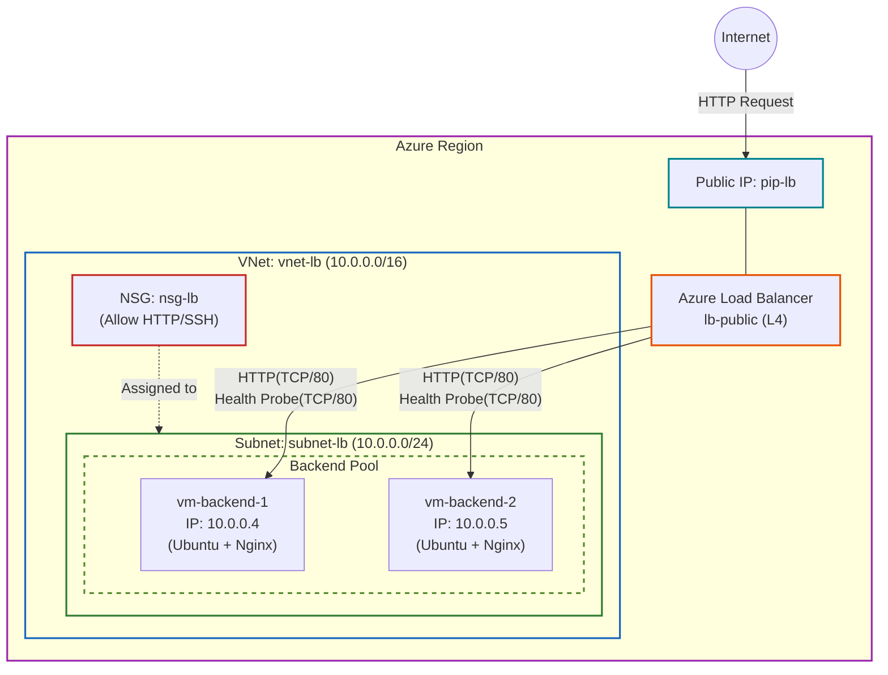

# Step9: ネットワーク構成図

```mermaid
graph TD
    %% 外部ネットワーク
    Internet((Internet))

    %% Azure リソースグループ・VNet
    subgraph Azure["Azure Region"]
        subgraph VNet["VNet: vnet-lb (10.0.0.0/16)"]
            
            NSG["NSG: nsg-lb<br/>(Allow HTTP/SSH)"]

            subgraph Subnet["Subnet: subnet-lb (10.0.0.0/24)"]
                %% バックエンドプール
                subgraph BackendPool["Backend Pool"]
                    VM1["vm-backend-1<br/>IP: 10.0.0.4<br/>(Ubuntu + Nginx)"]
                    VM2["vm-backend-2<br/>IP: 10.0.0.5<br/>(Ubuntu + Nginx)"]
                end
            end
        end
        
        %% Load Balancer
        PIP["Public IP: pip-lb"]
        LB["Azure Load Balancer<br/>lb-public (L4)"]
        
        %% 接続とルーティング
        PIP --- LB
        LB -- "HTTP(TCP/80)<br/>Health Probe(TCP/80)" --> VM1
        LB -- "HTTP(TCP/80)<br/>Health Probe(TCP/80)" --> VM2
        
        %% NSGの適用位置
        NSG -. "Assigned to" .-> Subnet
    end

    %% ユーザーからのアクセス
    Internet -- "HTTP Request" --> PIP

    %% スタイル（枠線を見やすく）
    style Azure stroke:#9c27b0,stroke-width:2px
    style VNet stroke:#1565c0,stroke-width:2px
    style Subnet stroke:#2e7d32,stroke-width:2px
    style BackendPool stroke:#558b2f,stroke-width:2px,stroke-dasharray:5 5
    style NSG stroke:#c62828,stroke-width:2px
    style LB stroke:#e65100,stroke-width:2px
    style PIP stroke:#00838f,stroke-width:2px
```
