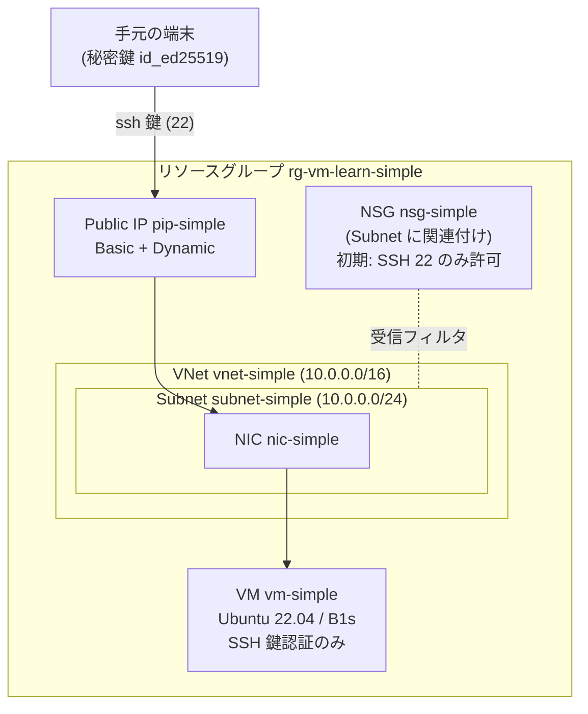
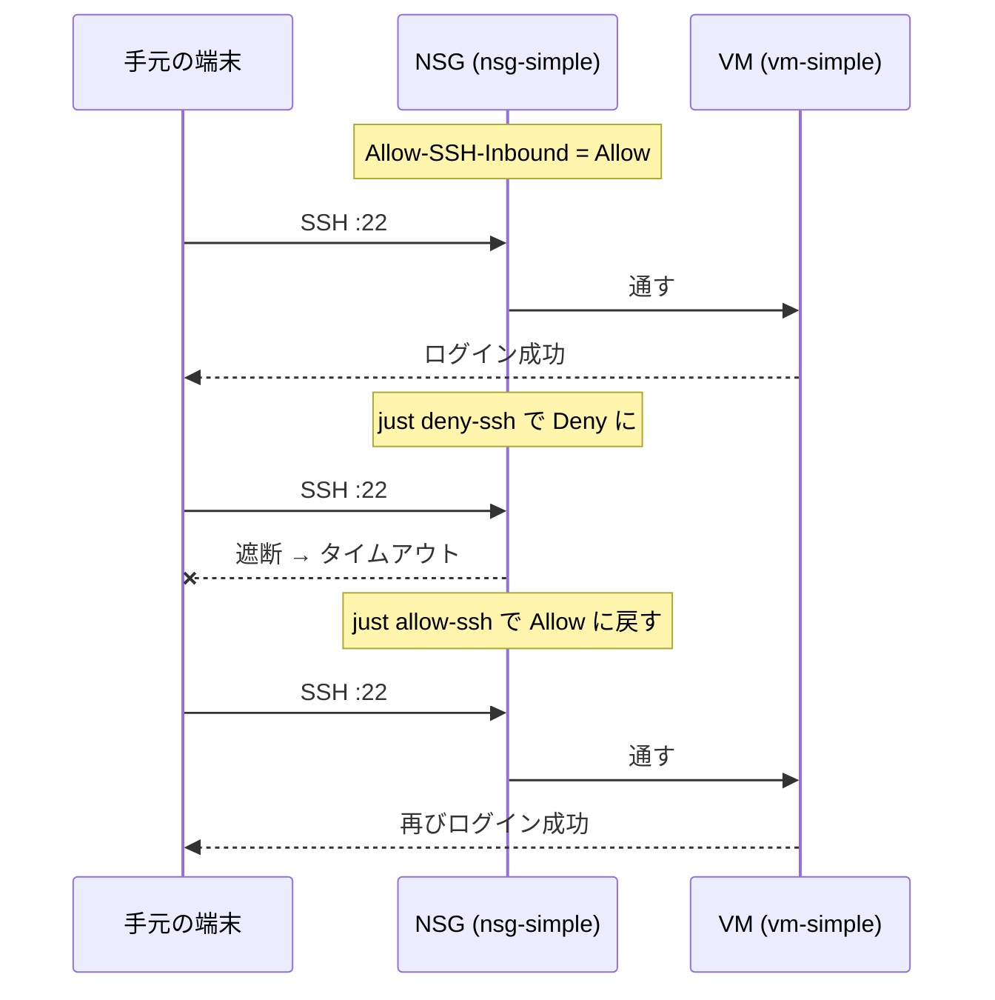
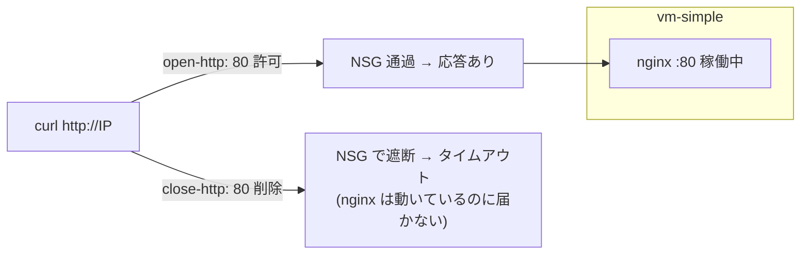
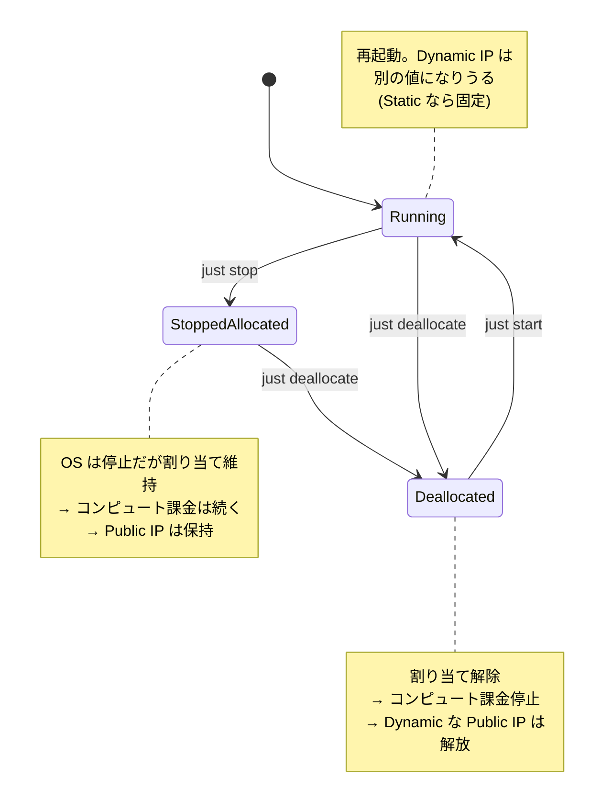

# MERMAID — `simple` の構成と実験

## 構成図（リソースの関係）

```mermaid
graph TD
    subgraph RG["リソースグループ rg-vm-learn-simple"]
        subgraph VNet["VNet vnet-simple (10.0.0.0/16)"]
            subgraph Subnet["Subnet subnet-simple (10.0.0.0/24)"]
                NIC["NIC nic-simple"]
            end
        end
        NSG["NSG nsg-simple<br/>(Subnet に関連付け)<br/>初期: SSH 22 のみ許可"]
        PIP["Public IP pip-simple<br/>Basic + Dynamic"]
        VM["VM vm-simple<br/>Ubuntu 22.04 / B1s<br/>SSH 鍵認証のみ"]
    end

    User["手元の端末<br/>(秘密鍵 id_ed25519)"]

    NSG -. "受信フィルタ" .- Subnet
    PIP --> NIC
    NIC --> VM
    User -- "ssh 鍵 (22)" --> PIP
```

## 実験1: NSG の SSH(22) で到達が変わる

```mermaid
sequenceDiagram
    participant U as 手元の端末
    participant N as NSG (nsg-simple)
    participant V as VM (vm-simple)

    Note over N: Allow-SSH-Inbound = Allow
    U->>N: SSH :22
    N->>V: 通す
    V-->>U: ログイン成功

    Note over N: just deny-ssh で Deny に
    U->>N: SSH :22
    N--xU: 遮断 → タイムアウト

    Note over N: just allow-ssh で Allow に戻す
    U->>N: SSH :22
    N->>V: 通す
    V-->>U: 再びログイン成功
```

## 実験2: 「プロセスが動く」と「届く」は別

```mermaid
graph LR
    subgraph VM["vm-simple"]
        nginx["nginx :80 稼働中"]
    end
    User["curl http://IP"]

    User -- "open-http: 80 許可" --> ok["NSG 通過 → 応答あり"]
    User -- "close-http: 80 削除" --> ng["NSG で遮断 → タイムアウト<br/>(nginx は動いているのに届かない)"]
    ok --> nginx
```

## 実験3: stop / deallocate と課金・IP

```mermaid
stateDiagram-v2
    [*] --> Running
    Running --> StoppedAllocated: just stop
    note right of StoppedAllocated
        OS は停止だが割り当て維持
        → コンピュート課金は続く
        → Public IP は保持
    end note
    Running --> Deallocated: just deallocate
    StoppedAllocated --> Deallocated: just deallocate
    note right of Deallocated
        割り当て解除
        → コンピュート課金停止
        → Dynamic な Public IP は解放
    end note
    Deallocated --> Running: just start
    note left of Running
        再起動。Dynamic IP は
        別の値になりうる
        (Static なら固定)
    end note
```
