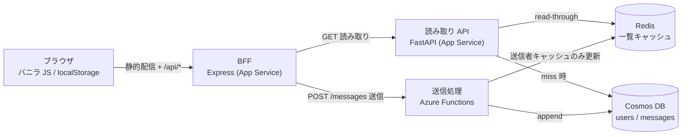
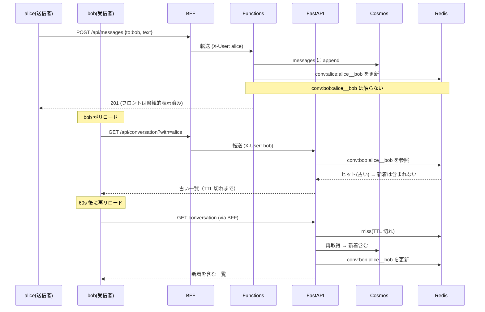

# MERMAID — 構成とフロー

## コンポーネント構成

```mermaid
flowchart LR
  Browser["ブラウザ<br/>バニラ JS / localStorage"]
  BFF["BFF<br/>Express (App Service)"]
  API["読み取り API<br/>FastAPI (App Service)"]
  FUNC["送信処理<br/>Azure Functions"]
  COSMOS[("Cosmos DB<br/>users / messages")]
  REDIS[("Redis<br/>一覧キャッシュ")]

  Browser -- "静的配信 + /api/*" --> BFF
  BFF -- "GET 読み取り" --> API
  BFF -- "POST /messages 送信" --> FUNC
  API -- "read-through" --> REDIS
  API -- "miss 時" --> COSMOS
  FUNC -- "append" --> COSMOS
  FUNC -- "送信者キャッシュのみ更新" --> REDIS
```

## メッセージ送信フロー（送信者は即時 / 受信者は陳腐化）

```mermaid
sequenceDiagram
  participant A as alice(送信者)
  participant B as bob(受信者)
  participant BFF
  participant FUNC as Functions
  participant API as FastAPI
  participant COSMOS as Cosmos
  participant REDIS as Redis

  A->>BFF: POST /api/messages {to:bob, text}
  BFF->>FUNC: 転送 (X-User: alice)
  FUNC->>COSMOS: messages に append
  FUNC->>REDIS: conv:alice:alice__bob を更新
  Note over FUNC,REDIS: conv:bob:alice__bob は触らない
  FUNC-->>A: 201 (フロントは楽観的表示済み)

  Note over B: bob がリロード
  B->>BFF: GET /api/conversation?with=alice
  BFF->>API: 転送 (X-User: bob)
  API->>REDIS: conv:bob:alice__bob を参照
  REDIS-->>API: ヒット(古い) → 新着は含まれない
  API-->>B: 古い一覧（TTL 切れまで）

  Note over B: 60s 後に再リロード
  B->>API: GET conversation (via BFF)
  API->>REDIS: miss(TTL 切れ)
  API->>COSMOS: 再取得 → 新着含む
  API->>REDIS: conv:bob:alice__bob を更新
  API-->>B: 新着を含む一覧
```
