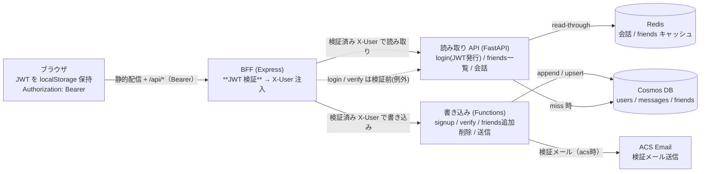
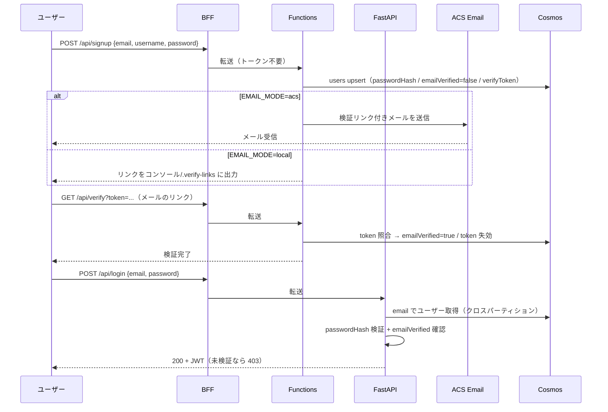
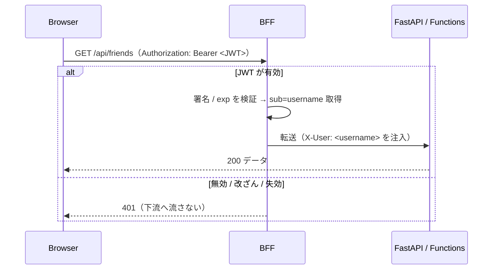
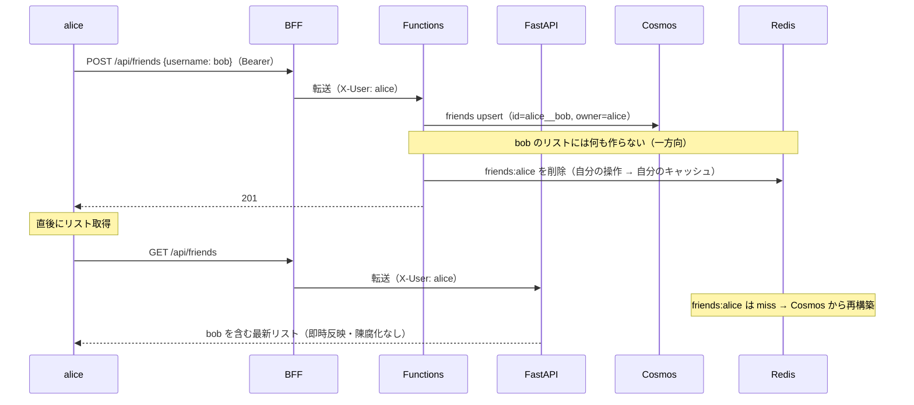

# MERMAID — 構成とフロー V2.0

V1 の構成図・メッセージ陳腐化フローは `versions/v1/MERMAID.md` を参照。
ここでは **V2 で追加する認証・友達リストのフロー** を示す。

## コンポーネント構成（V2・ACS と JWT 検証を追加）

## サインアップ → メール検証 → ログイン

## 認証済みリクエスト（BFF が信頼境界）

## 友達追加（自己完結：自分の操作 = 自分のキャッシュのみ）

