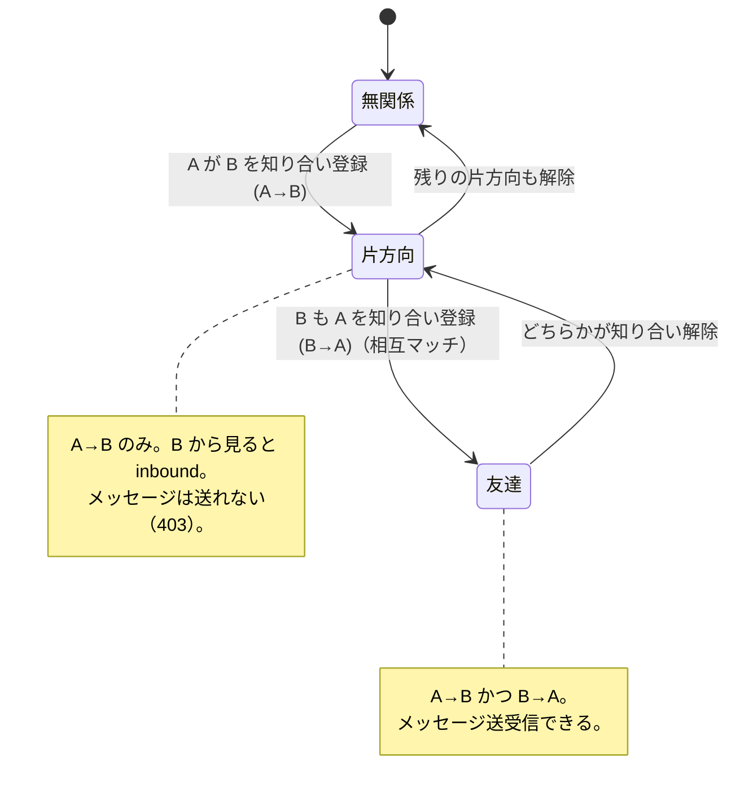
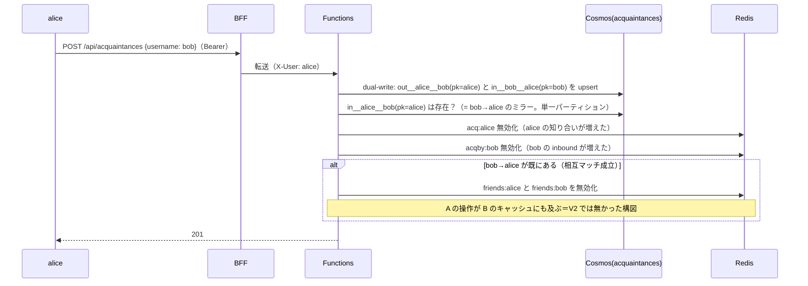
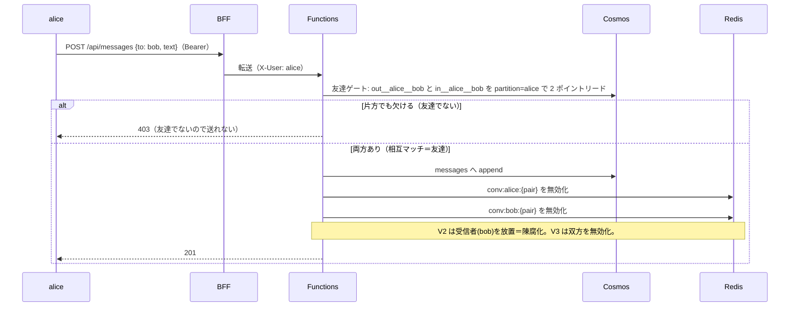
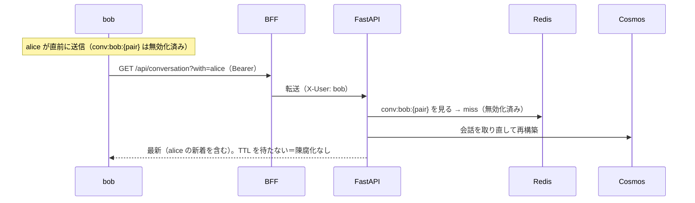
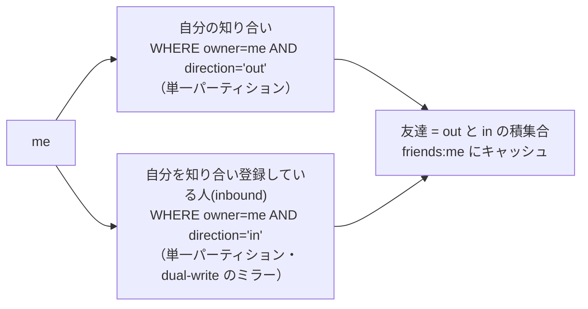

# MERMAID — 構成とフロー V3.0

V1（構成図・メッセージ陳腐化フロー）は `versions/v1/MERMAID.md`、
V2（認証・友達リストのフロー）は `versions/v2/MERMAID.md` を参照。
ここでは **V3 で変わる「知り合い／友達の二段階関係」「友達ゲート送信」「双方向キャッシュ無効化」** を示す。
コンポーネント構成は V2 から不変（新サービスなし）なので再掲しない。

## 関係の状態遷移（知り合い → 友達）

## 知り合い追加と「他人のキャッシュ」無効化（V3 の肝）

V2 と違い、A の操作は **B 側のキャッシュ**（inbound・相互成立時は友達）にも影響する。

## 友達ゲート付きメッセージ送信＋双方向キャッシュ無効化

## 受信者側の読み取り（陳腐化が解消されている）

## 友達一覧の導出（積集合）

